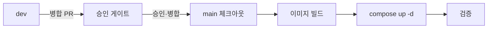

# 배포 가이드

| 항목 | 내용 |
|---|---|
| 설명 | dev·prod 2환경 배포의 필수 절차와 원칙 정의 |
| 생성일 | 2026-09-01 |
| 수정일 | 2026-09-01 |
| 버전 | 0.1.0 |

검증은 `dev`에서 수행하고 릴리스는 `main` 기준으로 배포함. 비밀값은 `.env`(gitignore)에서 주입하며 로그·문서에 출력하지 않음. compose 파일·Dockerfile은 프로젝트별로 배치하는 확장 지점임.

---

## 목차

| 번호 | 제목 | 설명 |
|---|---|---|
| 1 | 환경 구성 | dev·prod 환경과 파일 |
| 2 | 비밀값 관리 | `.env` 주입 원칙 |
| 3 | dev 배포 | 스택 기동·상태 확인 |
| 4 | prod 배포 | `main` 릴리스 배포 |
| 5 | DB 마이그레이션 | 기동 시 스키마 적용 |
| 6 | 롤백 | 이전 이미지 재기동 |
| 7 | 필수 금지 | 배포 시 금지 항목 |

---

## 1. 환경 구성

환경별로 compose 파일·env 파일을 분리하고 컨테이너·볼륨·네트워크 네임스페이스를 구분해 동시 기동을 허용함.

| 구분 | compose 파일 | env 파일 | 용도 |
|---|---|---|---|
| dev | `docker-compose-dev.yml` | `.env.dev` | 통합 검증 |
| prod | `docker-compose-prod.yml` | `.env.prod` | 운영 릴리스 |

- 로컬 개발 실행(docker 없이 또는 단일 DB)은 `backend/README.md`·`frontend/README.md`를 따름.
- compose 파일·Dockerfile은 프로젝트 요건에 맞춰 배치함(확장 지점).

---

## 2. 비밀값 관리

- 비밀값(`DB_PASSWORD`·`JWT_SECRET` 등)은 `.env.*`(gitignore)에서 주입함.
- prod 비밀값은 dev 값을 승격하지 않고 신규 생성함.
- 값은 헤더·환경변수로만 사용하고 로그·메시지·문서에 출력하지 않음.

---

## 3. dev 배포

1. `.env.dev`에 필수 비밀값이 있는지 확인함.
2. 전체 스택을 기동함.

```bash
docker compose -f docker-compose-dev.yml --env-file .env.dev up -d --build
```

3. 백엔드 헬스체크로 상태를 확인함: `GET /health` → `{"status":"UP"}`.

---

## 4. prod 배포

릴리스 브랜치 `main`에서 배포함.



1. **dev→main 병합 PR 생성**: `gh pr create --base main --head dev --fill`.
2. **승인 게이트**: PR 승인·병합을 요청함. 병합 가능 여부는 `gh pr view <PR번호> --json mergeable,mergeStateStatus`로 확인함.
3. **릴리스 체크아웃**: `git checkout main` → `git pull --ff-only`.
4. **백업**(prod 라이브 상태): 배포 전 DB 스냅샷을 남김.
5. **이미지 빌드**(현재 워킹트리 = `main`):

```bash
docker build -t <app>-backend:latest ./backend
docker build -t <app>-frontend:latest ./frontend
```

6. **기동**:

```bash
docker compose -f docker-compose-prod.yml --env-file .env.prod up -d
```

7. **검증**(exit 코드에만 의존하지 않음):
   - 컨테이너 상태: 대상 서비스가 재생성·healthy이고 기동 시각이 갱신됐는지 확인함.
   - HTTP 응답: 공개 엔드포인트가 `200`을 반환하는지 확인함.
   - 마이그레이션: 대상 스키마 버전이 적용됐는지 확인함(5절).

---

## 5. DB 마이그레이션

- `postgres` 프로파일 기동 시 Flyway가 미적용 마이그레이션(`db/migration/V{n}__*.sql`)을 자동 적용함(`validate` + 순서 강제).
- 엔티티 변경은 대응 `V{n}` 마이그레이션을 동반함.
- 파괴적 변경(컬럼 삭제·타입 변경) 전에는 DB 백업을 선행함.

---

## 6. 롤백

- 이전 이미지 태그로 재기동함: `docker compose -f docker-compose-prod.yml --env-file .env.prod up -d`(대상 서비스를 이전 태그로 지정).
- 볼륨은 유지함(데이터 보존).

---

## 7. 필수 금지

- prod 비밀값(DB 비밀번호·JWT 시크릿·API 키)을 로그·메시지·문서에 출력하는 것 → 금지(`.env`에서 읽어 사용).
- 롤백에서 볼륨 삭제 옵션(`down -v`)을 쓰는 것 → 금지(운영 데이터 유실).

---

## 참조 파일

- `docs/[GUIDE]_GIT_BRANCHING.md` — `dev`→`main` 릴리스 브랜치 흐름
- `backend/README.md` · `frontend/README.md` — 로컬 실행·빌드 정본
- `.gitignore` — `.env.*` 무시 규칙
- `docs/[GUIDE]_AUTHORING_STYLE.md` — 문서 작성요령

---

## 문서 갱신 이력

| 버전 | 수정일 | 주요 변경사항 |
|---|---|---|
| 0.1.0 | 2026-09-01 | 최초 작성 — 배포 필수 절차 중심의 표준 배포 가이드 |
