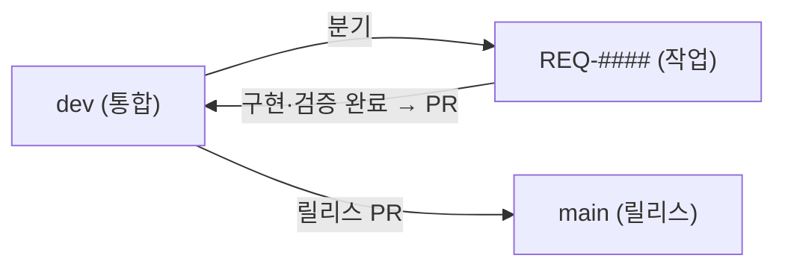

# Git 브랜치 가이드

| 항목 | 내용 |
|---|---|
| 설명 | `main`·`dev`·요구사항 브랜치의 역할과 분기·병합 흐름을 정한 기본 브랜치 운영 지침 |
| 생성일 | 2026-09-01 |
| 수정일 | 2026-09-01 |
| 버전 | 0.1.0 |

요구사항 작업은 `dev`에서 `REQ-####` 브랜치로 분기하고, 구현·검증 완료 시 PR로 `dev`에 병합함. `main`은 `dev`의 검증된 변경만 반영하는 릴리스 브랜치임.

---

## 목차

| 번호 | 제목 | 설명 |
|---|---|---|
| 1 | 브랜치 역할 | `main`·`dev`·`REQ-####`의 역할과 흐름 |
| 2 | 요구사항 브랜치 분기 | `dev`에서 작업 브랜치 생성 |
| 3 | 커밋·푸시 | 작업 브랜치 커밋과 원격 반영 |
| 4 | dev 병합 | 구현·검증 완료 시 PR 병합 |
| 5 | main 릴리스 | `dev` → `main` 반영 |
| 6 | 도구 분담 | `gh` CLI와 `git` 사용 구분 |

---

## 1. 브랜치 역할

| 브랜치 | 역할 | 반영 방식 |
|---|---|---|
| `main` | 릴리스 브랜치 | `dev`의 검증된 변경만 PR 병합으로 반영 |
| `dev` | 통합 브랜치 | 직접 커밋 또는 `REQ-####` 브랜치를 PR로 병합 |
| `REQ-####` | 요구사항 작업 브랜치 | `dev`에서 분기, 작업 후 PR로 `dev`에 병합 |



---

## 2. 요구사항 브랜치 분기

작업 시작 시 현재 브랜치를 `dev`로 두고, 최신 상태에서 `REQ-####` 브랜치를 분기함.

```bash
git checkout dev
git pull --ff-only
git checkout -b REQ-0001
```

---

## 3. 커밋·푸시

작업 브랜치(`REQ-####`)에서 커밋하고 원격으로 올림.

```bash
git add -A
git commit -m "REQ-0001 로그인 화면 구현"
git push -u origin REQ-0001
```

---

## 4. dev 병합

구현·검증 단계(백엔드 `./gradlew build`·프런트 `npm run build` 통과) 완료 시 PR로 `dev`에 병합함.

```bash
gh pr create --base dev --head REQ-0001 --fill
gh pr merge <PR번호> --merge --delete-branch
```

병합 후 `dev`를 동기화함.

```bash
git checkout dev
git pull --ff-only
```

- 연속 REQ 실행 시 앞 REQ를 `dev`에 병합한 뒤 다음 REQ를 `dev`에서 분기함.

---

## 5. main 릴리스

`dev`의 검증된 변경을 `main`으로 반영함.

```bash
gh pr create --base main --head dev --fill
gh pr merge <PR번호> --merge
```

**필수 금지**: `main` 직접 커밋. 릴리스는 PR 병합으로만 반영함.

---

## 6. 도구 분담

| 작업 | 도구 |
|---|---|
| GitHub 연동(PR·이슈·리뷰·릴리스) | `gh` CLI — 예: `gh pr create`, `gh pr merge` |
| 로컬 형상관리(add·commit·push·branch·log) | `git` |

- `gh`가 현재 셸 PATH에서 미검출이면 사유를 알리고 `git` 또는 REST 호출로 폴백함.

---

## 참조 파일

- `docs/UCPM_PIPELINE_GUIDE.md` — 단계별 실행에서 브랜치 분기·병합 시 본 가이드 참조
- `CLAUDE.md` — 「Git 규칙」 요약
- `docs/[GUIDE]_AUTHORING_STYLE.md` — 문서 작성요령

---

## 문서 갱신 이력

| 버전 | 수정일 | 주요 변경사항 |
|---|---|---|
| 0.1.0 | 2026-09-01 | 최초 작성 — 기본 브랜치 운영 가이드 |
