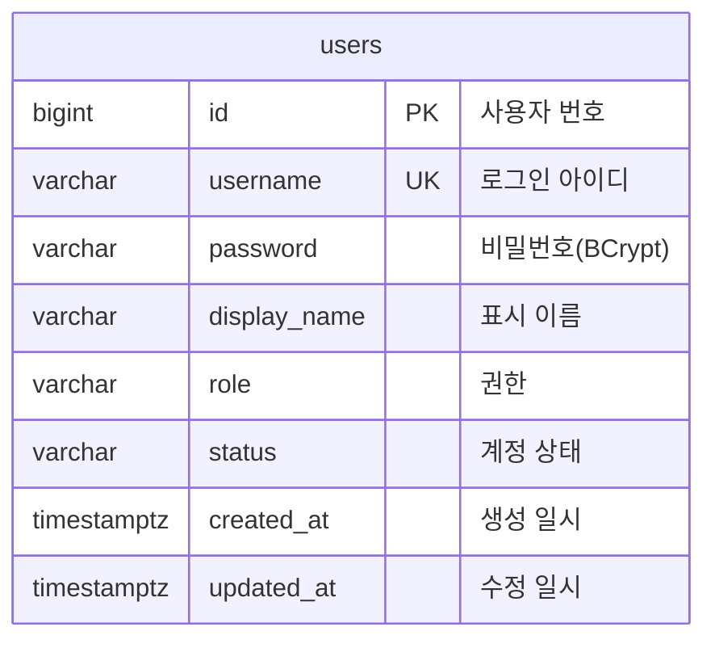

# 백엔드 테이블 명세 (SPEC)

| 항목 | 내용 |
|---|---|
| 설명 | 백엔드 DB 테이블의 ERD·목록·컬럼 상세 명세 |
| 생성일 | 2026-09-01 |
| 수정일 | 2026-09-01 |
| 버전 | 0.1.0 |

물리 스키마는 PostgreSQL(`postgres` 프로파일, Flyway `V1__init.sql`)을 정본으로 함. `local` 프로파일(H2)은 JPA가 엔티티로부터 동등 스키마를 생성함. 현재 테이블은 `users` 1개이며 신규 테이블 추가 시 동일 구조로 절을 추가함.

---

## 목차

| 번호 | 제목 | 설명 |
|---|---|---|
| 1 | ERD | 테이블 관계도 |
| 2 | 테이블 목록 | 테이블 요약 |
| 3 | 테이블 상세 | 테이블별 컬럼 명세 |

---

## 1. ERD

- 현재 단일 테이블이라 관계(FK)가 없음. 테이블이 추가되면 이 다이어그램에 관계를 표기함.

---

## 2. 테이블 목록

| # | 테이블 | 논리명 | 설명 | PK |
|---|---|---|---|---|
| 3.1 | `users` | 사용자 | 계정·로그인 정보 | `id` |

---

## 3. 테이블 상세

### 3.1 users

사용자 계정 테이블이다. PK는 `id`, 로그인 아이디 유일 제약은 `uk_users_username(username)`이다. 별도 보조 인덱스는 없다.

| 컬럼 | 물리 타입 | NULL | 기본값 | Key | 설명 |
|---|---|:---:|---|---|---|
| id | bigint | N | 자동증가(IDENTITY) | PK | 사용자 번호 |
| username | varchar(255) | N | - | UK | 로그인 아이디 |
| password | varchar(255) | N | - |  | 비밀번호(BCrypt 해시, 평문 미저장) |
| display_name | varchar(100) | Y | `NULL` |  | 표시 이름 |
| role | varchar(20) | N | - |  | 권한. `USER` or `ADMIN`(앱 기본 `USER`) |
| status | varchar(20) | N | - |  | 계정 상태. `ACTIVE` or `INACTIVE`(앱 기본 `ACTIVE`) |
| created_at | timestamptz | N | - |  | 생성 일시(JPA Auditing) |
| updated_at | timestamptz | N | - |  | 수정 일시(JPA Auditing) |

- `role`·`status`는 Java enum을 문자열로 저장함(`@Enumerated(STRING)`). DB 컬럼 기본값은 없고 앱에서 기본값을 설정함.
- `created_at`·`updated_at`은 `@CreatedDate`/`@LastModifiedDate`로 자동 기록함.

---

## 참조 파일

- `backend/src/main/resources/db/migration/V1__init.sql` — 물리 스키마 정본
- `backend/src/main/java/com/example/webapp/user/domain/User.java` — 엔티티
- `backend/src/main/java/com/example/webapp/common/domain/AuditableEntity.java` — 감사 필드
- `docs/[GUIDE]_BACKEND_MIGRATION.md` — 스키마 변경 규약

---

## 문서 갱신 이력

| 버전 | 수정일 | 주요 변경사항 |
|---|---|---|
| 0.1.0 | 2026-09-01 | 최초 작성 — `users` 테이블 ERD·목록·상세 |
