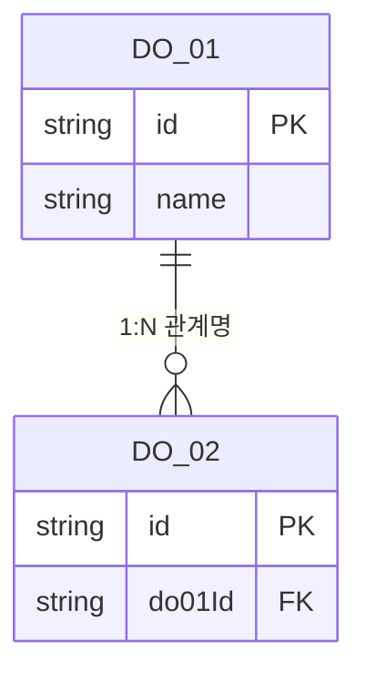
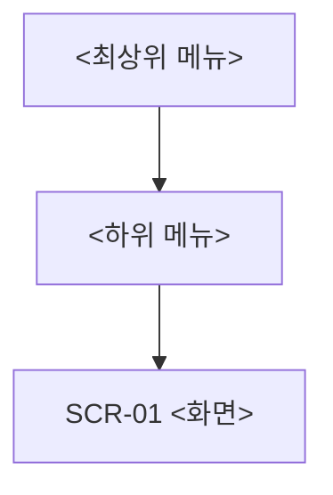

# IA 설계서 — &lt;프로젝트명&gt;

- **설명**: &lt;프로젝트명&gt;의 IA 설계 — 데이터 항목 정의·IA 구조 설계·화면 단위 기능 정의
- **생성일**: 2026-09-03
- **수정일**: 2026-09-03
- **버전**: 1.1

<!-- 작성 요령: docs/[GUIDE]_AUTHORING_STYLE.md 준수 — 두괄식·명사형 종결·코드서식·mermaid.
     `<...>`는 실제 값으로 교체. 요구사항정의서(What)를 입력으로 설계(How)를 정의. -->

---

## 목차

| 목차 | 제목 | 간략설명 |
|---|---|---|
| §1 | 데이터 항목 정의 | 데이터 객체 목록·관계 + 객체별 상세(enum 코드표 포함) |
| §2 | IA 구조 설계 | 데이터 Flow · 화면 Flow(와이어프레임) · 메뉴-화면-기능 |
| §3 | 기능 정의 | 화면 단위 기능명세(기능 목록 · 기능 상세) |

목적: 요구사항정의서를 입력으로 데이터·화면·기능 구조를 설계, 구현 단계의 입력 기준 제공.

---

## §1 데이터 항목 정의

### 1-1. 데이터 객체 목록 (관계)

데이터 객체 전체를 **목록표**로 나열하고, 객체 간 관계를 **ERD**로 도시.

| 객체 ID | 객체명 | 설명 | 주요 관계 |
|---|---|---|---|
| DO-01 | &lt;객체명&gt; | &lt;한 줄 설명&gt; | &lt;예: DO-02 1:N&gt; |
| DO-02 | &lt;객체명&gt; | &lt;…&gt; | &lt;…&gt; |

### 1-2. 데이터 객체별 상세

<!-- 각 DO-ID 별로 아래 블록 복제. enum 필드는 코드표(Code) 동반. -->

#### DO-01 &lt;객체명&gt;

| 필드 | 타입 | 필수 | 설명 | 비고 |
|---|---|:---:|---|---|
| id | &lt;식별자&gt; | Y | 고유 식별자 | PK |
| &lt;필드명&gt; | string | Y | &lt;설명&gt; | |
| &lt;상태필드&gt; | enum | Y | &lt;설명&gt; | 코드표 CODE-01 |

**코드표 CODE-01 &lt;상태필드&gt;** (enum)

| 코드값 | 라벨 | 설명 |
|---|---|---|
| &lt;VALUE_1&gt; | &lt;라벨&gt; | &lt;설명&gt; |
| &lt;VALUE_2&gt; | &lt;라벨&gt; | &lt;설명&gt; |

---

## §2 IA 구조 설계

### 2-1. 데이터 Flow

데이터의 생성·변경·이동 흐름을 도시.

### 2-2. 화면 Flow (와이어프레임)

화면 전이를 도시하고, 화면별 와이어프레임을 첨부.

| 화면 ID | 화면명 | 와이어프레임 | 비고 |
|---|---|---|---|
| SCR-01 | &lt;화면명&gt; | &lt;이미지 경로·링크&gt; | &lt;…&gt; |
| SCR-02 | &lt;화면명&gt; | &lt;이미지 경로·링크&gt; | &lt;…&gt; |

### 2-3. 메뉴구조 - 화면 - 기능 (연관 데이터 객체)

메뉴 트리를 도시하고, 메뉴·화면·기능·연관 데이터 객체를 **매핑표**로 정리.

| 메뉴 | 화면 ID | 화면명 | 기능(요약) | 연관 데이터 객체 |
|---|---|---|---|---|
| &lt;메뉴&gt; | SCR-01 | &lt;화면명&gt; | &lt;기능 요약&gt; | DO-01, DO-02 |

---

## §3 기능 정의 (화면 단위 기능명세)

### 3-1. 기능 목록

| 기능 ID | 화면 ID | 기능명 | 개요 |
|---|---|---|---|
| FN-01 | SCR-01 | &lt;기능명&gt; | &lt;한 줄 개요&gt; |
| FN-02 | SCR-01 | &lt;기능명&gt; | &lt;…&gt; |

### 3-2. 기능 상세

<!-- 각 FN-ID 별로 아래 블록 복제(화면 단위 명세). -->

#### FN-01 &lt;기능명&gt; (화면: SCR-01)

**기능 설명**

- &lt;기능 목적·동작 개요&gt;

**화면 UI Component**

| Component ID | 유형 | 설명 | 연관 데이터 |
|---|---|---|---|
| C-01 | &lt;입력창/버튼/목록 등&gt; | &lt;설명&gt; | DO-01.&lt;필드&gt; |
| C-02 | &lt;…&gt; | &lt;…&gt; | &lt;…&gt; |

**Component별 이벤트·동작**

| Component | 이벤트 | 동작 |
|---|---|---|
| C-01 | load | &lt;초기 표시·데이터 로드&gt; |
| C-02 | click | &lt;처리·이동·호출&gt; |
| C-02 | change | &lt;값 변경 시 동작&gt; |

---

## 참조 파일

| 영역 | 경로 |
|---|---|
| 요구사항정의서 양식(입력) | `./[요구분석]_요구사항정의서.md` |
| 요구사항 분석 가이드(절차) | `./[요구분석]_요구사항분석_가이드.md` |
| 가이드 작성 방식(문체·구조 정본) | `../docs/[GUIDE]_AUTHORING_STYLE.md` |
| IA 작성 가이드 | `../docs/[GUIDE]_IA_AUTHORING.md` |

---

## 문서 갱신 이력

| 버전 | 수정일 | 주요 변경사항 |
|---|---|---|
| 1.0 | 2026-09-03 | IA 설계서 템플릿 초판(데이터 항목 정의·IA 구조 설계·화면 단위 기능 정의 3부 구성 + ERD·Flow·매핑표·기능명세 서식) |
| 1.1 | 2026-09-03 | ERD 속성 문법 오류 수정(`id PK` → `string id PK`, mermaid `타입 이름 KEY` 순서) |
