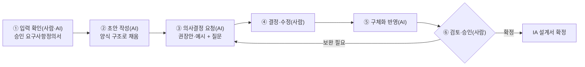

# IA 설계 가이드 (사람·AI 공통)

- **설명**: 사람과 AI가 협업해 요구사항정의서를 입력으로 IA 설계서를 점진적으로 구체화하는 절차·역할·항목별 작성 방식 정의
- **생성일**: 2026-09-03
- **수정일**: 2026-09-03
- **버전**: 1.0

---

## 목차

| 목차 | 제목 | 간략설명 |
|---|---|---|
| §1 | 목적·적용 대상 | 가이드 사용 범위와 대상(사람·AI) |
| §2 | 기본 원칙 | 요구(What) 입력·추적성·점진적 구체화·임의 확정 금지 |
| §3 | 협업 절차 | 입력 확인 → 초안 → 의사결정 요청 → 구체화 → 승인 |
| §4 | 사람·AI 역할 | 주체별 수행 역할(요구사항 분석과 동일) |
| §5 | 진입 지시문 작성법 (사람용) | 입력·산출물 지정 지시문 작성 요령·예시 |
| §6 | AI 작성 규칙 (AI용) | 초안·가정 표기·의사결정 요청 서식 |
| §7 | 산출물 구조 | IA 설계서 3부 구성·참조 템플릿 |
| §8 | 항목별 설계 방법·작성 방식 | 양식 항목별 도출 방법·작성 서식·추적성 |
| §9 | 제약사항 | 필수 준수 항목 |

목적: 승인된 요구사항정의서(What)를 입력으로, 추적성을 유지하며 데이터·화면·기능 구조(How)를 설계·확정하는 공통 기준 제공.

---

## §1 목적·적용 대상

- **목적**: IA 설계 단계에서 사람·AI가 같은 절차·역할·규칙으로 협업, IA 설계서 산출.
- **적용 대상**: 설계 방향을 제시·검토·승인하는 **사람**, 초안 작성·구체화를 수행하는 **AI**.
- **입력**: 승인된 요구사항정의서(`.idea/[요구분석]_요구사항정의서.md` 양식 산출물).
- **산출물**: IA 설계서(`.idea/[설계]_IA.md` 양식).

---

## §2 기본 원칙

가이드 전반을 관통하는 기조.

| 원칙 | 내용 |
|---|---|
| **요구(What) 입력** | 요구사항정의서를 입력으로 데이터·화면·기능 구조(How) 설계. 요구에 없는 신규 요구 발생 시 요구사항 분석으로 반려 |
| **추적성 유지** | 요구(FR) ↔ 데이터 객체 ↔ 화면 ↔ 기능 매핑 유지. 근거 없는 항목·고아 항목 배제 |
| **점진적 구체화** | 요구사항정의서 기반 초안에서 시작, 회차를 나눠 구체화. 1회 완성·확정 지양 |
| **임의 확정 금지** | 요구에 없는 설계 결정(명명·구조·이벤트 등)은 임의로 확정하지 않음. **권장안 + 예시**로 의사결정 요청 |
| **일관성** | 명명 규칙·enum 코드표·화면/기능 ID 규칙을 문서 전반에 일관 적용 |

---

## §3 협업 절차

요구사항정의서를 IA 설계서로 구체화하는 반복 절차.



- 각 회차는 **초안/구체화 + 의사결정 요청**으로 구성, 사람 결정 후 다음 회차 진행.
- 승인 전까지 AI는 산출물을 임의로 완결·확정하지 않음.

---

## §4 사람·AI 역할

요구사항 분석과 동일.

| 주체 | 수행 역할 |
|---|---|
| **사람** | 입력(요구사항정의서) 제공, 결과물 형태·구조 지정, 권장안 중 의사결정, 검토·수정 지시, 최종 승인 |
| **AI** | 양식 구조로 초안 작성, 도출 가능한 설계 정리, 공백은 권장안·예시로 의사결정 요청, 결정 반영·구체화, 상태 기록 |

- 판단 경계: **Human in the loop** — 사람이 방향·기준·승인을 보유, AI가 작성을 실행.

---

## §5 진입 지시문 작성법 (사람용)

입력(요구사항정의서)과 산출물(IA 양식)만 지정해 짧게 작성. 절차·규칙은 이 가이드를 참조로 위임.

**포함 요소**

| 요소 | 작성 내용 |
|---|---|
| 대상 | IA를 설계할 시스템 |
| 입력 | 승인된 요구사항정의서 경로 |
| 진행 방식 | 이 가이드(`.idea/[설계]_IA_가이드.md`) 절차 참조 |
| 산출물 | `.idea/[설계]_IA.md` 양식으로 IA 설계 초안 요청 |

**지시문 서식**

```text
[설계-IA] <시스템명>

- 대상: <IA를 설계할 시스템>
- 입력: `.idea\[요구분석]_요구사항정의서.md`(승인본)
- 진행 방식: `.idea\[설계]_IA_가이드.md` 절차에 따라 진행
- 산출물: `.idea\[설계]_IA.md` 양식으로 IA 설계 초안 작성
```

**예시 (회의록 관리시스템)**

```text
[설계-IA] 회의록 관리시스템

- 대상: 회의 일정 등록·회의록 기록·검토·ToDo·이력 관리 시스템
- 입력: `.idea\[요구분석]_요구사항정의서_회의록관리시스템.md`(승인본)
- 진행 방식: `.idea\[설계]_IA_가이드.md` 절차에 따라 진행
- 산출물: `.idea\[설계]_IA.md` 양식으로 IA 설계 초안 작성
```

---

## §6 AI 작성 규칙 (AI용)

**작성 순서**

1. 요구사항정의서에서 데이터 객체·화면·기능을 도출해 양식 구조(§7·§8)에 채움.
2. 요구에 근거 없는 설계 결정은 확정하지 않음 → 의사결정 요청 목록으로 분리.
3. 불가피한 임시값은 `(가정)` 표기, 승인 전까지 확정 아님으로 취급.
4. 요구(FR) ↔ 데이터 ↔ 화면 ↔ 기능 추적성을 매핑표로 확인(누락·고아 항목 표시).
5. 1차 초안 + 의사결정 요청까지 제시, 사람 결정 후 다음 회차에서 구체화.

**의사결정 요청 서식**

각 미결 항목을 아래 형태로 제시, 사람이 고르거나 지시하도록 함.

```text
[의사결정 요청] <항목명>
- 현황: <요구 근거 유무·부족한 이유>
- 권장안: <권장 방향 1순위>
- 예시(선택지): A) <...>  B) <...>  C) <...>
- 요청: 위 중 선택 또는 다른 방향 지시 요청
```

- 요구에 없는 신규 기능·요건이 필요하면 설계로 임의 추가하지 않고 요구사항 분석 반려 대상으로 표시.

---

## §7 산출물 구조

IA 설계서(`.idea/[설계]_IA.md`) 양식을 정본으로 사용. 3부 구성.

| 구성 | 내용 |
|---|---|
| §1 데이터 항목 정의 | 데이터 객체 목록·관계(ERD) + 객체별 상세(필드·enum 코드표) |
| §2 IA 구조 설계 | 데이터 Flow · 화면 Flow(와이어프레임) · 메뉴-화면-기능(연관 데이터 객체) |
| §3 기능 정의 | 화면 단위 기능명세(기능 목록 · 기능 상세: 설명·UI component·이벤트 동작) |

- 세부 항목 서식·플레이스홀더는 템플릿 파일을 따름.

---

## §8 항목별 설계 방법·작성 방식

양식 항목별로 **도출 방법(설계) · 작성 서식 · 추적성**을 정의.

### 8-1. 데이터 객체 목록 (관계) — 양식 §1-1

- **설계 방법**: 요구사항정의서 기능·데이터 요건에서 핵심 명사(엔티티) 추출 → 데이터 객체화. 객체 간 관계(1:1·1:N·N:M)와 방향 식별.
- **작성 방식**: 목록표(객체 ID·객체명·설명·주요 관계) + 관계는 **ERD(mermaid `erDiagram`)** 로 도시.
- **추적성**: 각 객체의 도출 근거 FR 표기. 요구에 없는 객체 배제.

### 8-2. 데이터 객체별 상세 (코드표) — 양식 §1-2

- **설계 방법**: 객체별 필드·타입·필수·제약(PK/FK 포함) 정의. 유한 값 집합 필드는 enum으로 분리해 **코드표** 작성.
- **작성 방식**: 필드표(필드·타입·필수·설명·비고) + enum은 `CODE-##` 코드표(코드값·라벨·설명)로 동반.
- **규칙**: 명명·코드값 규칙 일관(예: 코드값 대문자 스네이크), PK/FK 명시.

### 8-3. 데이터 Flow — 양식 §2-1

- **설계 방법**: 데이터 생성·변경·조회 흐름을 행위자·객체 단위로 추적. 상태 전이가 있으면 흐름에 반영.
- **작성 방식**: mermaid `flowchart`. 노드=행위자/데이터 객체, 엣지=동작(생성·수정·참조·조회).

### 8-4. 화면 Flow (와이어프레임) — 양식 §2-2

- **설계 방법**: 사용자 과업 흐름 기반 화면 도출·전이(이동 조건) 정의. 화면별 요소 배치를 저충실도로 스케치.
- **작성 방식**: 화면 전이 mermaid `flowchart` + 화면표(화면 ID·화면명·와이어프레임 링크). 와이어프레임은 요소 배치 중심(색·픽셀 지양).

### 8-5. 메뉴구조 - 화면 - 기능 (연관 데이터 객체) — 양식 §2-3

- **설계 방법**: 정보구조를 메뉴 계층으로 정리. 메뉴 → 화면 → 기능 → 연관 데이터 객체를 매핑.
- **작성 방식**: 메뉴 트리 mermaid + 매핑표(메뉴·화면 ID·화면명·기능 요약·연관 DO).
- **추적성**: 모든 화면이 메뉴에, 모든 기능이 화면에, 모든 FR이 기능에 매핑됨을 확인(커버리지 점검).

### 8-6. 기능 목록 — 양식 §3-1

- **설계 방법**: 화면 단위로 기능 분해. 각 기능을 FR과 매핑.
- **작성 방식**: 기능표(기능 ID·화면 ID·기능명·개요).

### 8-7. 기능 상세 (화면 단위 기능명세) — 양식 §3-2

- **설계 방법**: 화면 UI component 식별, component별 이벤트(load·click·change·submit 등)와 동작 정의. 동작은 데이터 객체 CRUD·화면 전이·외부 호출로 기술.
- **작성 방식**: 기능 설명 + UI Component 표(Component ID·유형·설명·연관 데이터) + 이벤트·동작 표(Component·이벤트·동작).
- **규칙**: 실제 발생 이벤트만 기술, 동작은 연관 데이터 객체·화면 ID로 연결.

---

## §9 제약사항

필수 준수 항목.

- 입력(요구사항정의서)에 근거해 설계 — 요구에 없는 신규 요건은 요구사항 분석으로 반려.
- 요구 ↔ 데이터 ↔ 화면 ↔ 기능 추적성 유지.
- 설계 판단 공백은 권장안·예시로 의사결정 요청 후 반영.
- 명명·enum 코드표·ID 규칙을 일관 적용.
- 산출물 확정은 사람 승인으로 처리.

---

## 참조 파일

| 영역 | 경로 |
|---|---|
| IA 설계서 양식(정본) | `./[설계]_IA.md` |
| 요구사항정의서 양식(입력) | `./[요구분석]_요구사항정의서.md` |
| 요구사항 분석 가이드(선행 단계) | `./[요구분석]_요구사항분석_가이드.md` |
| 가이드 작성 방식(문체·구조 정본) | `../docs/[GUIDE]_AUTHORING_STYLE.md` |

---

## 문서 갱신 이력

| 버전 | 수정일 | 주요 변경사항 |
|---|---|---|
| 1.0 | 2026-09-03 | IA 설계 가이드 초판(원칙·협업 절차·사람/AI 역할·진입 지시문·AI 작성 규칙·산출물 구조·항목별 설계 방법·작성 방식) |
