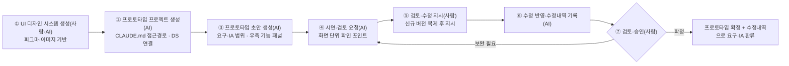
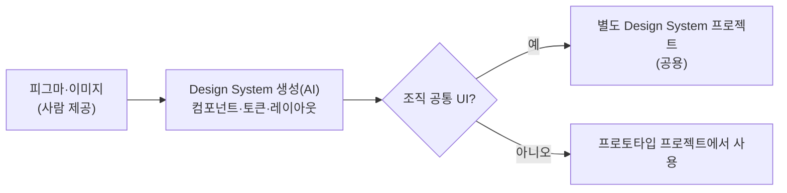

# 화면 프로토타입 가이드 (사람·AI 공통)

- **설명**: 사람과 AI가 협업해 요구사항정의서·IA 설계서를 입력으로 Claude Design으로 화면 프로토타입을 생성·검토·환류하는 절차·역할·작성 방식 정의
- **생성일**: 2026-09-04
- **수정일**: 2026-09-04
- **버전**: 1.0

---

## 목차

| 목차 | 제목 | 간략설명 |
|---|---|---|
| §1 | 목적·적용 대상 | 가이드 사용 범위와 대상(사람·AI) |
| §2 | 기본 원칙 | Claude Design 직접 사용·Design System 기반·토큰화·범위 준수 |
| §3 | 협업 절차 | 디자인 시스템 → 프로토타입 생성 → 검토·환류 |
| §4 | 사람·AI 역할 | 주체별 수행 역할 |
| §5 | 진입 지시문 작성법 (사람용) | 입력·산출물 지정 지시문 작성 요령·예시 |
| §6 | UI 디자인 시스템 생성 | Design System 생성·조직 공통 UI 분리 |
| §7 | 프로토타입 프로젝트 생성·작성 | 프로젝트 연결·컴포넌트/토큰 사용·범위·명명 |
| §8 | 산출물 구조 | 결과물 명명·우측 기능 패널 구성 |
| §9 | 검토·리뷰 결과 반영 | 버전 복제·수정내역 기록·상위 산출물 환류 |
| §10 | 제약사항 | 필수 준수 항목 |

목적: 승인된 요구사항정의서·IA 설계서를 입력으로, 그 범위 내에서 Claude Design 기반 화면 프로토타입을 생성·검토·확정하고, 검토 결과를 상위 산출물로 환류하는 공통 기준 제공.

---

## §1 목적·적용 대상

- **목적**: 화면 프로토타입 단계에서 사람·AI가 같은 절차·역할·규칙으로 협업, Claude Design 기반 프로토타입 산출.
- **적용 대상**: 방향 제시·검토·승인을 수행하는 **사람**, 디자인 시스템·프로토타입 생성·수정을 수행하는 **AI**.
- **입력**: 승인된 요구사항정의서(`.idea/[요구분석]_요구사항정의서.md` 양식 산출물), 승인된 IA 설계서(`.idea/[설계]_IA.md` 양식 산출물).
- **산출물**: Claude Design 프로토타입 결과물(`<프로토타입명>_dc_v0.1.md`), 수정내역(`<프로토타입명>_수정내역_v0.1.md`).
- **도구**: Claude Design 직접 사용(claude-design MCP 미사용).

---

## §2 기본 원칙

가이드 전반을 관통하는 기조.

| 원칙 | 내용 |
|---|---|
| **Claude Design 직접 사용** | 프로토타입 작성은 Claude Design에서 직접 수행. claude-design MCP 미사용 |
| **Design System 기반** | Design System의 컴포넌트·토큰·레이아웃을 기본으로 사용 |
| **토큰화** | 화면 레이아웃 형태 값은 Token으로 생성·처리. 값 하드코딩 미사용 |
| **범위 준수** | 요구사항정의서·IA 범위 내에서 프로토타입 생성. 범위 밖 신규 요건은 상위 산출물 환류 대상 |
| **추적성 유지** | 화면 ↔ IA 기능정의 ↔ 컴포넌트·동작 매핑 유지 |
| **점진적 구체화** | 초안에서 시작, 회차·버전을 나눠 구체화. 1회 완성·확정 지양 |

---

## §3 협업 절차

요구사항정의서·IA를 프로토타입으로 구체화하고 검토 결과를 환류하는 반복 절차.



- 각 회차는 **생성·수정 + 시연·검토 요청**으로 구성, 사람 결정 후 다음 회차 진행.
- 승인 전까지 AI는 산출물을 임의로 완결·확정하지 않음.

---

## §4 사람·AI 역할

| 주체 | 수행 역할 |
|---|---|
| **사람** | 입력(요구사항정의서·IA) 제공, 디자인 기준(피그마·이미지) 제공, 신규 컴포넌트 시안 승인, 검토·수정 지시, 신규 버전 복제 지시, 최종 승인 |
| **AI** | Design System 생성, 프로토타입 생성·토큰화, 우측 기능 패널 구성, 수정 반영·수정내역 기록, 상위 산출물 환류 |

- 판단 경계: **Human in the loop** — 사람이 방향·기준·승인 보유, AI가 생성·수정 실행.

---

## §5 진입 지시문 작성법 (사람용)

입력(요구사항정의서·IA)과 산출물(프로토타입)만 지정해 짧게 작성. 절차·규칙은 이 가이드를 참조로 위임.

**포함 요소**

| 요소 | 작성 내용 |
|---|---|
| 대상 | 프로토타입을 생성할 시스템 |
| 입력 | 승인된 요구사항정의서·IA 설계서 경로 |
| 진행 방식 | 이 가이드(`.idea/[설계]_화면프로토타입_가이드.md`) 절차 참조 |
| 산출물 | Claude Design 프로토타입(`<프로토타입명>_dc_v0.1.md`) |

**지시문 서식**

```text
[설계-프로토타입] <시스템명>

- 대상: <프로토타입을 생성할 시스템>
- 입력: `.idea\[요구분석]_요구사항정의서.md`(승인본) · `.idea\[설계]_IA.md`(승인본)
- 진행 방식: `.idea\[설계]_화면프로토타입_가이드.md` 절차에 따라 진행
- 산출물: Claude Design 프로토타입(`<프로토타입명>_dc_v0.1.md`)
```

**예시 (회의록 관리시스템)**

```text
[설계-프로토타입] 회의록 관리시스템

- 대상: 회의 일정 등록·회의록 기록·검토·ToDo·이력 관리 시스템
- 입력: `.idea\[요구분석]_요구사항정의서_회의록관리시스템.md`(승인본) · `.idea\[설계]_IA.md`(승인본)
- 진행 방식: `.idea\[설계]_화면프로토타입_가이드.md` 절차에 따라 진행
- 산출물: Claude Design 프로토타입(`회의록관리_dc_v0.1.md`)
```

---

## §6 UI 디자인 시스템 생성

프로토타입 컴포넌트·토큰·레이아웃의 기준이 되는 Design System을 우선 생성.

- **생성 기준**: 디자인된 피그마·이미지를 기본으로 Design System 생성.
- **조직 공통 UI**: 조직 공통 UI는 별도 Design System 프로젝트로 생성해 여러 프로토타입에서 공용.
- **구성 요소**: 컴포넌트·토큰(색·타이포·간격·레이아웃 등)·레이아웃 규칙 포함.



---

## §7 프로토타입 프로젝트 생성·작성

Design System을 연결해 프로토타입 프로젝트를 생성하고, 요구·IA 범위 내에서 화면을 작성.

- **프로젝트 연결**: 생성된 프로토타입 프로젝트 연결을 위해 `CLAUDE.md`에 프로젝트 접근 경로 추가.
- **컴포넌트·토큰 사용**: Design System의 컴포넌트·토큰·레이아웃을 기본으로 사용.
- **신규 컴포넌트 처리**: Design System에 없는 컴포넌트는 시안 제공 → 사람 승인 → Design System에 추가 후 반영.
- **토큰화**: 화면 레이아웃 형태 값은 Token으로 생성·처리. 값 하드코딩 미사용.
- **범위**: 입력받은 요구사항정의서·IA 범위 내에서 프로토타입 생성.
- **명명**: 결과물 이름에 버전 표시 — `<프로토타입명>_dc_v0.1.md` 형태.


---

## §8 산출물 구조

프로토타입 결과물은 화면과 함께 IA 기능정의서 내용을 담는 우측 패널을 포함.

- **결과물 명명**: `<프로토타입명>_dc_v0.1.md` (버전 표시).
- **우측 기능 패널**: 전체화면 우측에 IA 기능정의서 내용을 표시하는 패널 생성. 보이기/숨기기 토글 포함.

**우측 기능 패널 구성**

| 영역 | 내용 |
|---|---|
| **상단** | 화면명 · 화면 ID · 화면 설명 |
| **하단(컴포넌트 단위)** | 번호 · 컴포넌트 설명 |
| **하단(컴포넌트 동작)** | 동작명(Load / click / select 등) · 동작 방식 |

- 동작 방식은 표·입력 항목의 경우 요약하지 않고 전체 기술.

---

## §9 검토·리뷰 결과 반영

검토 결과를 신규 버전으로 반영하고, 수정내역을 상위 산출물 갱신 입력으로 환류.

**절차**

| 주체 | 수행 내용 |
|---|---|
| **사람** | 기존 버전을 복제한 신규 버전 프로토타입 생성 후 수정 지시 |
| **AI** | 수정 내용 반영 + 변경 내용을 별도 md로 기술(`<프로토타입명>_수정내역_v0.1.md`) |

**수정내역 기재 항목** (`<프로토타입명>_수정내역_v0.1.md`)

| 항목 | 내용 |
|---|---|
| 날짜 | 수정 반영 일자 |
| 화면명 / ID | 대상 화면 |
| 지시내용 | 사람 수정 지시 |
| 수정내용 | 반영 내용(구체적으로 기술) |

**환류**

- 수정 완료 승인 후 `<프로토타입명>_수정내역_v0.1.md`를 요구사항정의서·IA 갱신 입력으로 활용.


---

## §10 제약사항

필수 준수 항목.

- 프로토타입 작성은 Claude Design 직접 사용(claude-design MCP 미사용).
- Design System의 컴포넌트·토큰·레이아웃 기반 작성. 신규 컴포넌트는 시안 승인 후 Design System 반영.
- 레이아웃 형태 값은 Token으로 처리(값 하드코딩 미사용).
- 요구사항정의서·IA 범위 내에서 생성. 범위 밖 신규 요건은 상위 산출물 환류.
- 결과물·수정내역은 버전 표기 명명 규칙 적용(`_dc_v0.1`·`_수정내역_v0.1`).
- 산출물 확정은 사람 승인으로 처리.

---

## 참조 파일

| 영역 | 경로 |
|---|---|
| 요구사항정의서 양식(입력) | `./[요구분석]_요구사항정의서.md` |
| IA 설계서 양식(입력·환류 대상) | `./[설계]_IA.md` |
| IA 설계 가이드(선행 단계) | `./[설계]_IA_가이드.md` |
| 가이드 작성 방식(문체·구조 정본) | `../docs/[GUIDE]_AUTHORING_STYLE.md` |

---

## 문서 갱신 이력

| 버전 | 수정일 | 주요 변경사항 |
|---|---|---|
| 1.0 | 2026-09-04 | 화면 프로토타입 가이드 초판(Claude Design 직접 사용·Design System 생성·프로토타입 프로젝트 생성·우측 기능 패널·검토 결과 버전 복제·수정내역·상위 산출물 환류) |
