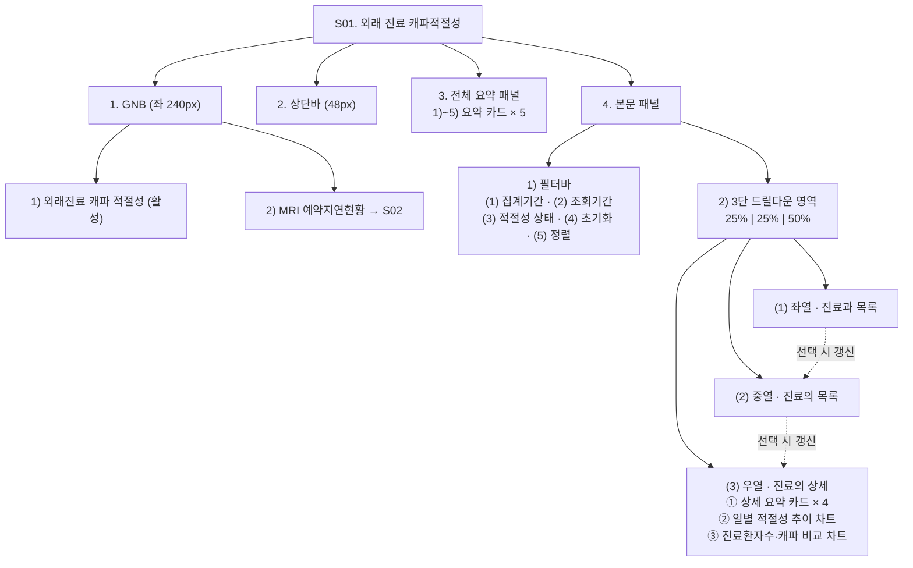
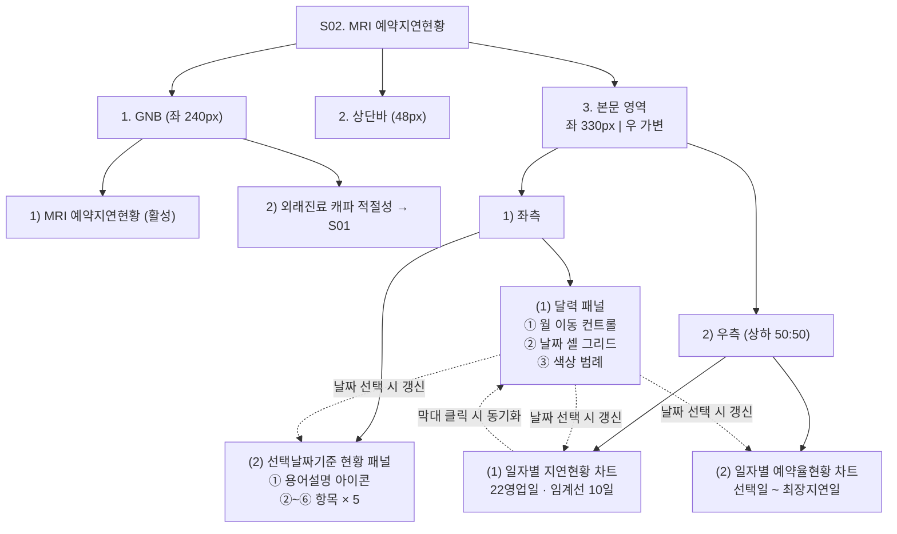

# 외래진료 캐파적절성 · MRI 예약지연현황 기능정의서

| 항목 | 내용 |
|---|---|
| 설명 | 화면 단위 컴포넌트·엘리먼트별 이벤트와 동작 정의 |
| 생성일 | 2026-09-03 |
| 수정일 | 2026-09-03 |
| 버전 | v1.0 |

---

## 목차
| 목차 | 제목 | 간략설명 |
|---|---|---|
| 1 | 화면 목록 | 대상 화면 ID와 화면명 |
| 2 | Index 표기 규칙 | 계층별 기호 체계 |
| 3 | S01. 외래 진료 캐파적절성 | 화면 설명·구조도·레이아웃·컴포넌트 정의 |
| 4 | S02. MRI 예약지연현황 | 화면 설명·구조도·레이아웃·컴포넌트 정의 |
| 5 | 화면 상태값 · 전이 | 화면 단위 상태와 전이 조건 |
| 6 | 상태별 표시 정의 | 항목별 Default·Hover·Selected·Disabled·Error |
| 7 | 오류·예외 메시지 | 상황별 표시 문구 |
| 8 | 로딩 표시 정의 | 스켈레톤 방식 상세 |
| 9 | 협의 필요 사항 | 미확정 항목 |

---

## 1. 화면 목록
| 화면ID | 화면명 |
|---|---|
| S01 | 외래 진료 캐파적절성 |
| S02 | MRI 예약지연현황 |

---

## 2. Index 표기 규칙
| 기호 | 계층 | 대상 |
|---|---|---|
| `1.` | 1depth | 화면 구성 영역 (GNB / 상단바 / 요약 패널 / 본문 패널) || `1)` | 2depth | 영역 내 컴포넌트 (필터바 / 드릴다운 영역 / 좌·우측) |
| `(1)` | 3depth | 컴포넌트 내 엘리먼트 (드롭다운 / 목록 / 차트) |
| `①` | 4depth | 엘리먼트의 항목·컬럼 |

---

## 3. S01. 외래 진료 캐파적절성

### 3.1 화면 설명
진료과·진료의별 캐파설정 적절성 3단 드릴다운 조회 화면임

### 3.2 컴포넌트 구조도


### 3.3 화면 레이아웃
```
┌───────────┬─────────────────────────────────────────────────────────┐
│           │ 2. 상단바 (48px)                                        │
│  1. GNB   ├─────────────────────────────────────────────────────────┤
│  (240px)  │ 3. 전체 요약 패널                                       │
│           │ ┌───────┐┌───────┐┌───────┐┌───────┐┌───────┐          │
│ ● 외래진료 │ │ 1)    ││ 2)    ││ 3)    ││ 4)    ││ 5)    │          │
│   캐파적절성│ │ 분석  ││ 적절성││ 위험  ││ 경고  ││ 예약  │          │
│   (활성)   │ │ 대상  ││       ││       ││       ││ 비율  │          │
│           │ └───────┘└───────┘└───────┘└───────┘└───────┘          │
│ ○ MRI     ├─────────────────────────────────────────────────────────┤
│   예약지연 │ 4. 본문 패널                                            │
│   현황     │ ┌─ 1) 필터바 ────────────────────────────────────────┐ │
│           │ │ (1)집계기간 (2)조회기간 (3)적절성 (4)초기화  (5)정렬│ │
│           │ └────────────────────────────────────────────────────┘ │
│           │ ┌─ 2) 3단 드릴다운 ──────────────────────────────────┐ │
│           │ │ (1) 좌열    │ (2) 중열    │ (3) 우열               │ │
│           │ │ 진료과 목록 │ 진료의 목록 │ 진료의 상세            │ │
│           │ │             │             │ ┌────────────────────┐ │ │
│           │ │             │             │ │ ① 요약 카드 × 4    │ │ │
│           │ │  ──▶ 선택 시│  ──▶ 선택 시│ ├────────────────────┤ │ │
│           │ │    (2) 갱신 │    (3) 갱신 │ │ ② 적절성 추이 차트 │ │ │
│ ⚙ 설정    │ │             │             │ ├────────────────────┤ │ │
│           │ │             │             │ │ ③ 환자수·캐파 차트 │ │ │
│           │ │    25%      │    25%      │ └──────── 50% ───────┘ │ │
│           │ └────────────────────────────────────────────────────┘ │
└───────────┴─────────────────────────────────────────────────────────┘
```

### 3.4 컴포넌트 및 엘리먼트

**1. GNB**
- 1) `외래진료 캐파 적절성` 메뉴
  - onClick : 본 화면 전환 및 메뉴 활성 표시
- 2) `MRI 예약지연현황` 메뉴
  - onClick : S02 화면 전환

**2. 상단바**
- 기존 공통 컴포넌트 사용, 본 화면 전용 동작 없음
- breadcrumb `경영지표 분석`
  - 표시 전용
- 알림·전체화면·계정 아이콘
  - 기존 시스템 공통 동작 유지, 본 산출물 정의 대상 제외

**3. 전체 요약 패널 (요약 카드 5개)**
- onLoad : 조회기간(기본 현재일 − 1개월 ~ 현재일, 배치 산출 기준) 전체 진료과·진료교수 기준 5개 지표 표시
- 필터 연동 : 적절성 상태 필터 변경 시 5개 지표 전부 필터 적용 모수 기준으로 재계산
- 항목
  | Index | 항목명 | 설명 |
  |---|---|---|
  | 1) | 분석 대상 | 조회 대상 진료과 수(개과) 및 진료교수 수(명) |
  | 2) | 캐파설정 적절성 | 전체 진료교수 캐파설정 적절성 평균(%), 70%↓ 위험·70~80% 경고·80%↑ 양호 색상 적용 |
  | 3) | 위험 (70% 미만) | 적절성 70% 미만 진료교수 수(명) |
  | 4) | 경고 (70~80%) | 적절성 70% 이상 80% 미만 진료교수 수(명) |
  | 5) | 예약환자 비율 | 전체 진료교수 예약환자 비율 평균(%) |

**4. 본문 패널 › 1) 필터바 › (1) 집계기간 (드롭다운)**
- 기본값 : `월간`
- 선택값 : `월간` / `주간` / `직접지정`
- 기간 산출 규칙 (롤링 기준)
  | 선택값 | 산출 기간 |
  |---|---|
  | 월간 | 현재일 − 1개월 ~ 현재일 |
  | 주간 | 현재일 − 7일 ~ 현재일 |
  | 직접지정 | 사용자가 조회기간 달력에서 지정한 값 유지 |
- onChange (`월간`·`주간`) : 롤링 기준으로 조회기간 자동 갱신 및 전체 요약·목록·차트 재조회
- onChange (`직접지정`) : 조회기간 변경 없이 현재 기간 유지
- 자동 전환 : 사용자가 조회기간 달력을 직접 변경하면 본 드롭다운이 `직접지정`으로 자동 전환

**4. 본문 패널 › 1) 필터바 › (2) 조회기간 (시작일 ~ 종료일 달력)**
- 기본값 : 현재일 − 1개월 ~ 현재일 (예 : `2026-08-03 ~ 2026-09-03`)
- 유효성 검증
  - 시작일 ≤ 종료일
  - 종료일 ≤ 현재일
  - 시작일~종료일 최대 `92일` (3개월)
- onChange : 변경 기간 기준 재조회, 진료과·진료의 선택 유지, 집계기간 드롭다운을 `직접지정`으로 자동 전환

**4. 본문 패널 › 1) 필터바 › (3) 적절성 상태 (드롭다운)**
- 기본값 : `전체`
- 선택값 : `전체` / `양호` / `경고` / `위험`
- onChange : 선택 상태 기준 좌열·중열 목록 재필터링, 진료과·진료의 선택 초기화

**4. 본문 패널 › 1) 필터바 › (4) 초기화 버튼**
- onClick : 전체 필터를 기본값(집계기간 `월간` / 조회기간 현재일 − 1개월 ~ 현재일 / 적절성 `전체` / 정렬 오름차순)으로 복원 후 재조회

**4. 본문 패널 › 1) 필터바 › (5) 정렬 (목록 상단 우측)**
- 기본값 : 적절성 오름차순
- 선택값 : 적절성 오름차순(기본) / 적절성 내림차순
- onClick : 정렬 기준 전환 및 좌열·중열 목록 재정렬

**4. 본문 패널 › 2) 드릴다운 › (1) 좌열 · 진료과 목록**
- onLoad : 적절성 평균 오름차순 전체 진료과 표시, 첫 번째 진료과 자동 선택
- 진료과 행
  - onClick : 해당 행 선택 표시, 중열 소속 진료의 목록 갱신, 우열을 중열 첫 진료의 기준으로 갱신
- 항목
  | Index | 항목명 | 설명 |
  |---|---|---|
  | ① | 진료과명 | 진료과 명칭 |
  | ② | 적절성 평균(%) | 소속 진료의 캐파설정 적절성 평균값 |
  | ③ | 적절성 최소(%) | 소속 진료의 중 캐파설정 적절성 최솟값 |

**4. 본문 패널 › 2) 드릴다운 › (2) 중열 · 진료의 목록**
- onLoad : 좌열 선택 진료과 소속 진료의 적절성 오름차순 표시, 첫 번째 진료의 자동 선택
- 진료의 행
  - onClick : 해당 행 선택 표시, 우열 상세 패널 갱신
- 항목
  | Index | 항목명 | 설명 |
  |---|---|---|
  | ① | 진료교수명 | 진료의(교수) 성명 |
  | ② | 적절성(%) | 캐파수 ÷ 진료수 기준 캐파설정 적절성 |
  | ③ | 예약비율(%) | 전체 진료건 중 사전예약 건 비율 |
  | ④ | 캐파/일 | 진료일 기준 일평균 배정 캐파 수 |

**4. 본문 패널 › 2) 드릴다운 › (3) 우열 · ① 상세 요약 카드 (4개)**
- onLoad : 선택 진료의 적절성·예약비율·캐파/일·미달일 표시
- 항목
  | Index | 항목명 | 설명 |
  |---|---|---|
  | ①-1 | 적절성 | 캐파수 ÷ 진료수 기준 캐파설정 적절성(%), 70%↓ 위험·70~80% 경고·80%↑ 양호 |
  | ①-2 | 예약비율 | 전체 진료건 중 사전예약 건 비율(%) |
  | ①-3 | 캐파/일 | 진료일 기준 일평균 배정 캐파 수 |
  | ①-4 | 미달일 | 조회 기간 중 적절성 80% 미달 진료일 수 |

**4. 본문 패널 › 2) 드릴다운 › (3) 우열 · ② 일별 적절성 추이 차트**
- onLoad : 선택 진료의 진료일별 적절성(%) 막대그래프 표시, 70%·80% 임계선 표시
- 막대 색상 : 위험(70%↓) 빨강 / 경고(70~80%) 노랑 / 양호(80%↑) 녹색
- 가로 스크롤 : 막대 1건당 최소 폭 `24px` 보장, 차트 폭 초과 시 가로 스크롤 (Y축·임계선 좌측 고정)
- 막대
  - onHover : 툴팁 표시 — `n일 · 적절성 nn.n% (양호|경고|위험)`

**4. 본문 패널 › 2) 드릴다운 › (3) 우열 · ③ 진료환자수·캐파 비교 차트**
- onLoad : 예약·당일접수 환자수 누적 막대 표시, 동일 축에 캐파 선+포인트 중첩 표시
- 가로 스크롤 : ②와 동일 규칙 적용, 두 차트 스크롤 위치 동기화
- 막대
  - onHover : 툴팁 표시 — `n일 · 예약 nn명 / 당일 nn명 / 캐파 nn`

---

## 4. S02. MRI 예약지연현황

### 4.1 화면 설명
배치생성일 달력 선택 기반 예약지연 여부·추이 확인 화면임

### 4.2 컴포넌트 구조도


### 4.3 화면 레이아웃
```
┌───────────┬─────────────────────────────────────────────────────────┐
│           │ 2. 상단바 (48px)                                        │
│  1. GNB   ├─────────────────────────────────────────────────────────┤
│  (240px)  │ 3. 본문 영역                                            │
│           │ ┌─ 1) 좌측 (330px) ─┐ ┌─ 2) 우측 (가변) ─────────────┐ │
│ ● MRI     │ │ (1) 달력 패널     │ │ (1) 일자별 지연현황 차트     │ │
│   예약지연 │ │ ① ‹ YYYY.MM ›    │ │     22영업일 · 임계선 10일   │ │
│   현황     │ │ ② 날짜 셀 그리드  │ │     ▬▬▬▬▬▬▬▬▬▬▬▬▬▬▬▬▬▬▬▬   │ │
│   (활성)   │ │    □□□□□□□        │ │                              │ │
│           │ │    □□□□□□□        │ │     막대 클릭 ──▶ 달력 동기화│ │
│ ○ 외래진료 │ │ ③ 색상 범례       │ │                              │ │
│   캐파적절성│ └────────┬─────────┘ ├──────────────────────────────┤ │
│           │          │ 날짜 선택   │ (2) 일자별 예약율현황 차트   │ │
│           │          └────▶───────▶│     선택일 ~ 최장지연일      │ │
│           │ ┌──────────────────┐ │     임계선 80% · 40%         │ │
│           │ │ (2) 선택날짜기준  │ │     ▬▬▬▬▬▬▬▬▬▬▬▬▬▬▬▬▬▬▬▬   │ │
│ ⚙ 설정    │ │     현황 패널     │ │                              │ │
│           │ │ ① ?  ②~⑥ 항목×5 │ │                              │ │
│           │ └──────────────────┘ └──────────────────────────────┘ │
└───────────┴─────────────────────────────────────────────────────────┘
```

### 4.4 컴포넌트 및 엘리먼트

**1. GNB**
- 1) `MRI 예약지연현황` 메뉴
  - onClick : 본 화면 전환 및 메뉴 활성 표시
- 2) `외래진료 캐파 적절성` 메뉴
  - onClick : S01 화면 전환

**2. 상단바**
- S01의 `2.`와 동일 규칙 적용

**3. 본문 영역 › 1) 좌측 › (1) 달력 패널**
- 이동 가능 범위 : 제한 없음(전체 배치 이력), 미래 월은 이력 없음으로 표시
- onLoad : 현재 날짜 소속 월 표시, 현재일(휴일 시 직전 영업일) 자동 선택
- ① 월 이동 버튼 `‹`
  - onClick : 전월 이동, 선택 날짜 유지 (달력 표시 범위 밖이면 선택 표시만 미노출)
- ① 월 이동 버튼 `›`
  - onClick : 익월 이동, 선택 날짜 유지 (달력 표시 범위 밖이면 선택 표시만 미노출)
- ② 날짜 셀 색상 : 예약지연여부 색상 표시 (Y=빨강, N=녹색, 휴일·이력없음=회색)
- ② 날짜 셀(워킹데이)
  - onClick : 해당 날짜 선택 표시, 선택날짜기준 현황 패널·일자별 지연현황 차트·일자별 예약율현황 차트 갱신
- ② 날짜 셀(주말·휴일)
  - 비활성 처리, 커서 `default`
- ③ 색상 범례 : 달력 하단에 지연(Y)·정상(N)·휴일·이력없음 3종 마커와 라벨 표시

**3. 본문 영역 › 1) 좌측 › (2) 선택날짜기준 현황 패널**
- onLoad : 선택 날짜의 5개 항목 표시
- ① 용어설명 아이콘 `?`
  - onHover : 5개 용어 설명 박스 표시
  - onMouseLeave : 설명 박스 숨김
- 항목
  | Index | 항목명 | 설명 |
  |---|---|---|
  | ② | 지연여부 | 워킹데이 `+0~+9` 구간 내 M/L 등급 일자 3개 미만 시 `Y`(지연), 3개 이상 시 `N`(정상) |
  | ③ | 최장지연일 | M/L 등급 일자가 누적 3번째로 나타나는 날짜 (휴일 제외) |
  | ④ | 최장지연일수 | 배치생성일부터 최장지연일까지 경과일수 (휴일 제외) |
  | ⑤ | 연속지연일수 | 지연여부 `Y`가 연속으로 이어진 배치생성일 수 |
  | ⑥ | 연속지연기간 | 연속지연 시작일부터 종료일(또는 현재)까지 구간 |

**3. 본문 영역 › 2) 우측 › (1) 일자별 지연현황 차트**
- 조회 범위 : 선택 날짜 기준 과거 `22영업일` 고정
- 임계값 : `10영업일` 고정 (코드 상수)
- onLoad : 최장지연일수 막대그래프 표시, Y축 5일 단위, 10일 임계선 강조 표시
- 막대
  - onClick : 해당 배치생성일을 달력·선택날짜기준 현황 패널·일자별 예약율현황 차트에 동일 반영
  - onHover : 툴팁 표시 — 정상 `월/일 · 최장지연일수 n일 / 지연여부 Y|N`, 배치 실패 `월/일 · 배치 산출 실패`, 이력 없음 `월/일 · 이력 없음`

**3. 본문 영역 › 2) 우측 › (2) 일자별 예약율현황 차트**
- 조회 범위 : 선택 날짜 ~ 최장지연일 (M/L 누적 3번째 도달일)
- onLoad : 구간 일별 예약율(%) 막대그래프 표시, Y축 `100/80/40/0%`, H/M/L 등급별 색상 적용
- X축 라벨 : `월/일` 포맷, 구간 일수별 간출 (10일 이하 매일, 11~16일 2일 간격, 17일 이상 3일 간격), 요일은 툴팁에서 제공
- 막대
  - onHover : 툴팁 표시 — 정상 `월/일(요일) · 예약율 nn% / 등급 H|M|L`, 휴일 `월/일(요일) · 휴일`

**공통 · 툴팁 표시 스펙**
- 대상 : S01 `4.-2)-(3)-②`·`③`, S02 `3.-2)-(1)`·`(2)` 차트 막대
- 위치 : 막대 상단 중앙 기준 상방 `6px` 이격, 수평 중앙 정렬
- 딜레이 : hover 진입 후 `150ms`, 이탈 시 즉시 숨김
- 스타일 : 배경 `#2B3540`, 글자 `#FFFFFF` `11px`, 패딩 `6×9px`, radius `4px`, 한 줄 고정

---

## 5. 화면 상태값 · 전이

### 5.1 S01. 외래 진료 캐파적절성
| 상태 | 진입 조건 | 화면 표시 | 전이 |
|---|---|---|---|
| `INIT` | 화면 진입 | 필터 기본값 적용 → 조회 → 첫 진료과·첫 진료의 선택 | 조회 성공 → `SELECTED` / 결과 0건 → `EMPTY` / 실패 → `ERROR` || `SELECTED` | 진료과·진료의 선택 완료 | 3열 전체 + 요약·차트 표시 | 필터 변경 → `INIT` / 진료과 변경 → 중·우열 갱신 후 `SELECTED` 유지 / 진료의 변경 → 우열 갱신 |
| `EMPTY` | 필터 결과 진료과 0건 | 좌열 안내 문구, 중·우열 빈 상태, 요약 카드 `-` | 필터 변경·초기화 → `INIT` |
| `INVALID` | 조회기간 유효성 위반 | 조회기간 하단 오류 문구, 직전 결과 유지 | 유효 기간 재입력 → `INIT` |
| `ERROR` | 조회 API 실패 | 해당 영역 오류 문구 + `다시 시도` | 재시도 성공 → `SELECTED` |

### 5.2 S02. MRI 예약지연현황
| 상태 | 진입 조건 | 화면 표시 | 전이 |
|---|---|---|---|
| `INIT` | 화면 진입 | 현재 월 표시, 현재일(휴일 시 직전 영업일) 선택 | 이력 있음 → `SELECTED` / 배치 실패 → `FAILED_DATE` / 월 전체 이력 없음 → `NO_HISTORY` |
| `SELECTED` | 워킹데이 선택 완료 | 현황 패널 5항목 + 지연현황·예약율 차트 표시 | 다른 날짜·막대 선택 → `SELECTED` 유지 / 월 이동 시 선택 유지 |
| `FAILED_DATE` | 선택일이 배치 실패(`FAIL`) | 현황 패널 5항목 `-` + 실패 안내, 예약율 차트 실패 안내 | 다른 날짜 선택 → `SELECTED` |
| `NO_HISTORY` | 조회 월 전체가 배치 이력 없음 (미래 월·배치 가동 이전 월) | 달력 셀 전지 회색 + 하단 안내, 우측 차트는 직전 선택일 기준 유지 | 이력 있는 월로 이동 → `SELECTED` |
| `ERROR` | 조회 API 실패 | 해당 영역 오류 문구 + `다시 시도` | 재시도 성공 → `SELECTED` |

### 5.3 공통 규칙
- 상태는 화면 단위로 1개만 유지, 컴포넌트별 개별 상태 미보유
- 상태 전이 시 갱신 대상은 구조도의 연결 규칙에 정의된 컴포넌트로 한정
- 화면 재진입 시 `INIT`부터 시작

---

## 6. 상태별 표시 정의

해당 상태가 발생하는 항목만 정의함. 미기재 상태는 해당 항목에 미존재.

### 6.1 S01. 외래 진료 캐파적절성
| Index | 항목 | 상태 | 표시 |
|---|---|---|---|
| `4.-1)-(1)` / `(3)` | 드롭다운 | Default | 테두리 `#D5DBE1`, 배경 `#FFFFFF`, 글자 `#5A6773` |
| `4.-1)-(2)` | 조회기간 달력 | Default | 테두리 `#D5DBE1`, 배경 `#FFFFFF` |
| `4.-1)-(2)` | 조회기간 달력 | Error | 테두리 `#E8546B`, 하단 오류 문구 표시, 조회 미실행 |
| `4.-1)-(4)` | 초기화 버튼 | Default | 배경 `#57B0A0`, 글자 `#FFFFFF`, 높이 `30px` |
| `4.-1)-(4)` | 초기화 버튼 | Hover | 배경 `#3E9686` |
| `4.-2)-(1)` | 진료과 목록 행 | Default | 배경 `#FFFFFF` |
| `4.-2)-(1)` | 진료과 목록 행 | Hover | 배경 `#EEF5F3`, 커서 `pointer` |
| `4.-2)-(1)` | 진료과 목록 행 | Selected | 배경 `#EDF5F3`, 진료과명 굵게 `#2F6F63` |
| `4.-2)-(2)` | 진료의 목록 행 | Default | 배경 `#FFFFFF` |
| `4.-2)-(2)` | 진료의 목록 행 | Hover | 배경 `#EEF5F3`, 커서 `pointer` |
| `4.-2)-(2)` | 진료의 목록 행 | Selected | 배경 `#EDF5F3`, 진료교수명 굵게 `#2F6F63` |
| `4.-2)-(3)-②` / `③` | 차트 막대 | Hover | 툴팁 표시 (공통 툴팁 스펙 참조) |

### 6.2 S02. MRI 예약지연현황
| Index | 항목 | 상태 | 표시 |
|---|---|---|---|
| `3.-1)-(1)-①` | 월 이동 버튼 | Default | 글자 `#5A6773` |
| `3.-1)-(1)-①` | 월 이동 버튼 | Hover | 배경 `#F2F5F7` |
| `3.-1)-(1)-②` | 날짜 셀 (워킹데이) | Default | 지연여부 색상 배경, 글자 `#FFFFFF`, 커서 `pointer` |
| `3.-1)-(1)-②` | 날짜 셀 (워킹데이) | Selected | 테두리 `2px #2B3540` |
| `3.-1)-(1)-②` | 날짜 셀 (주말·휴일·이력없음) | Disabled | 배경 `#F0F2F4`, 글자 `#9AA5B1`, 커서 `default`, 클릭 이벤트 미발생 |
| `3.-1)-(2)-①` | 용어설명 아이콘 | Default | 배경 `#D5DBE1`, 글자 `#FFFFFF`, 커서 `help` |
| `3.-1)-(2)-①` | 용어설명 아이콘 | Hover | 배경 `#8A97A3`, 설명 박스 표시 |
| `3.-2)-(1)` | 지연현황 차트 막대 | Default | 지연여부 색상, 커서 `pointer` |
| `3.-2)-(1)` | 지연현황 차트 막대 | Selected | 테두리 `2px #2B3540` |
| `3.-2)-(1)` | 지연현황 차트 막대 | Hover | 툴팁 표시 (공통 툴팁 스펙 참조) |
| `3.-2)-(2)` | 예약율 차트 막대 | Default | 등급별 색상 |
| `3.-2)-(2)` | 예약율 차트 막대 | Hover | 툴팁 표시 (공통 툴팁 스펙 참조) |

### 6.3 상태 적용 범위
- Error : 조회기간 입력 `S01 4.-1)-(2)`에 한정. 그 외 조회 실패는 오류·예외 메시지의 영역 단위 표시로 처리
- Disabled : 날짜 셀 `S02 3.-1)-(1)-②`에 한정. 그 외 컨트롤은 상시 활성
- Selected : 단일 선택 컴포넌트(목록 행·날짜 셀·차트 막대)에 한정

---

## 7. 오류·예외 메시지

발생 가능한 항목만 정의함. 미기재 컴포넌트는 예외 상황 미발생.

### 7.1 S01. 외래 진료 캐파적절성
| Index | 항목 | 상황 | 표시 문구 |
|---|---|---|---|
| `3.` | 전체 요약 카드 | 필터 결과 대상 0건 | 각 수치 자리에 `-` 표기, 카드 레이아웃 유지 |
| `4.-1)-(2)` | 조회기간 | 시작일 > 종료일 | `시작일은 종료일보다 이후일 수 없습니다.` |
| `4.-1)-(2)` | 조회기간 | 종료일이 현재일 이후 | `조회 종료일은 현재일까지 선택할 수 있습니다.` |
| `4.-1)-(2)` | 조회기간 | 조회 범위 3개월 초과 | `조회 기간은 최대 3개월까지 지정할 수 있습니다.` |
| `4.-2)-(1)` | 좌열 진료과 목록 | 필터 결과 0건 | 목록 영역 중앙에 `해당 조건의 진료과가 없습니다.` |
| `4.-2)-(2)` | 중열 진료의 목록 | 좌열 미선택 | 목록 영역 중앙에 `진료과를 선택해 주세요.` |
| `4.-2)-(3)-①` | 상세 요약 카드 | 진료의 미선택 또는 진료 이력 없음 | 각 수치 자리에 `-` 표기 |
| `4.-2)-(3)-②` | 일별 적절성 추이 차트 | 조회기간 내 진료일 0일 | 차트 영역 중앙에 `조회 기간에 진료 이력이 없습니다.` |
| `4.-2)-(3)-③` | 진료환자수·캐파 비교 차트 | 조회기간 내 진료일 0일 | 차트 영역 중앙에 `조회 기간에 진료 이력이 없습니다.` |
| 공통 | 조회 API 실패 | 타임아웃·5xx | 해당 영역에 `데이터를 불러오지 못했습니다. 다시 시도해 주세요.` + `다시 시도` 버튼 |

### 7.2 S02. MRI 예약지연현황
| Index | 항목 | 상황 | 표시 문구 |
|---|---|---|---|
| `3.-1)-(1)` | 달력 | 조회 월 전체가 배치 이력 없음 | 셀 전체 회색 처리, 달력 하단에 `해당 월의 배치 이력이 없습니다.` 표시 (우측 차트는 직전 선택일 기준 유지) |
| `3.-1)-(2)` | 선택날짜기준 현황 패널 | 선택일이 배치 실패(`FAIL`) | 5개 항목 `-` 표기, 패널 하단에 `해당 일자의 배치 산출이 실패하여 값을 표시할 수 없습니다.` |
| `3.-1)-(2)-③④` | 최장지연일 / 최장지연일수 | 조회 범위 내 M/L 누적 3개 미도달 | 두 항목 `산출 불가` 표기 |
| `3.-2)-(1)` | 일자별 지연현황 차트 | 22영업일 전체가 이력 없음 | 차트 영역 중앙에 `표시할 배치 이력이 없습니다.` |
| `3.-2)-(1)` | 일자별 지연현황 차트 | 개별 일자의 배치 실패·이력 없음 | 해당 막대 회색 최소 높이 + 수치 `-` 표기 |
| `3.-2)-(2)` | 일자별 예약율현황 차트 | 최장지연일 미도달 | 차트 영역 중앙에 `최장지연일이 산출되지 않아 구간을 표시할 수 없습니다.` |
| `3.-2)-(2)` | 일자별 예약율현황 차트 | 선택일이 배치 실패(`FAIL`) | 차트 영역 중앙에 `해당 일자의 배치 산출이 실패하여 값을 표시할 수 없습니다.` |
| 공통 | 조회 API 실패 | 타임아웃·5xx | 해당 영역에 `데이터를 불러오지 못했습니다. 다시 시도해 주세요.` + `다시 시도` 버튼 |

### 7.3 공통 규칙
- 빈 상태·오류 상태에서도 컴포넌트 영역과 레이아웃 유지
- 값 없음은 `-`로 표기 (0 대입·직전값 보간 금지)
- 조회 실패 영역만 오류 표시, 그 외 영역은 기존 값 유지
- 유효성 오류는 입력 컨트롤 하단에 표시하고 조회 미실행

---

## 8. 로딩 표시 정의

전 화면 공통으로 **스켈레톤** 방식 사용. 스피너·기존값 유지 방식 사용 금지.

| 대상 | 표시 방식 |
|---|---|
| 요약 카드 | 항목명은 그대로 유지, 수치 자리에 회상 마대 표시 |
| 목록 | 헤더 유지, 본문 행을 회상 막대 5개로 대지 |
| 차트 | 축·임계선 유지, 막대·선 자리에 회상 복족 표시 |
| 달력 | 그리드 구조 유지, 셀 배경을 회상으로 표시 |

### 공통 규칙
- 스켈레톤 배경 `#EDF1F4`, 상하 밝기 진동 어니메이션 `1.4s` 무한 반복
- 재조회 시 새로 갱신되는 영역만 스켈레톤 적용. 직전 값 유지 금지
- 필터 컨트롤은 스켈레톤 대상 아님. 로딩 중에도 상시 조작 가능

---

## 9. 협의 필요 사항
현재 없음.

---

## 참조 파일
| 경로 | 설명 |
|---|---|
| `경영지표분석-프로토타입.dc.html` | 본 정의서 기준 프로토타입 |
| `한림대-경영지표분석-프로토타입.html` | 단독 실행 배포본 |
| `uploads/[GUIDE]_AUTHORING_STYLE.md` | 문서 작성 방식 가이드 |

---

## 문서 갱신 이력
| 버전 | 수정일 | 주요 변경사항 |
|---|---|---|
| v1.0 | 2026-09-03 | 최초 작성. S01·S02 컴포넌트 정의, 상태값·전이, 오류·예외 메시지, 로딩 표시 수록 |
