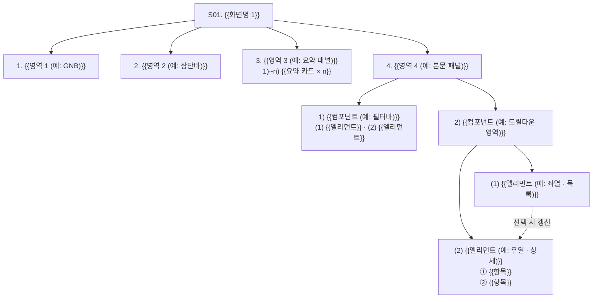
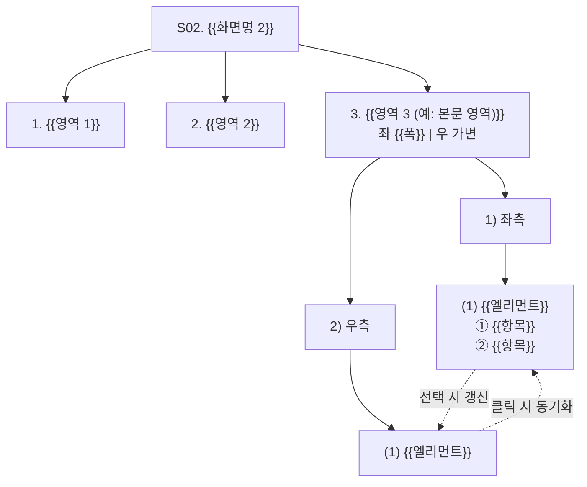

# {{시스템명}} · {{화면군명}} 기능정의서

<!--
  기능정의서 템플릿 사용 방법
  - `{{...}}` 자리는 실제 값으로 치환. `<!-- -->` 주석은 작성 후 전부 삭제
  - 작성 규칙 정본은 `[설계]기능정의서_작성지침.md`. 본 템플릿의 구조·표기는 지침 §2~§9를 그대로 따름
  - 화면이 3개 이상이면 §3·§4 블록을 화면 수만큼 복제하고 이후 섹션 번호(5~9)를 재정리
  - 화면에 없는 컴포넌트 Index는 남기지 않음. 삭제 시 후속 번호 전부 재정리
  - 예시 값(진료과·달력 등)은 작성 요령을 보이기 위한 것이며 도메인에 맞게 전면 교체
-->

| 항목 | 내용 |
|---|---|
| 설명 | 화면 단위 컴포넌트·엘리먼트별 이벤트와 동작 정의 |
| 생성일 | {{YYYY-MM-DD}} |
| 수정일 | {{YYYY-MM-DD}} |
| 버전 | v1.0 |

---

## 목차
| 목차 | 제목 | 간략설명 |
|---|---|---|
| 1 | 화면 목록 | 대상 화면 ID와 화면명 |
| 2 | Index 표기 규칙 | 계층별 기호 체계 |
| 3 | S01. {{화면명 1}} | 화면 설명·구조도·레이아웃·컴포넌트 정의 |
| 4 | S02. {{화면명 2}} | 화면 설명·구조도·레이아웃·컴포넌트 정의 |
| 5 | 화면 상태값 · 전이 | 화면 단위 상태와 전이 조건 |
| 6 | 상태별 표시 정의 | 항목별 Default·Hover·Selected·Disabled·Error |
| 7 | 오류·예외 메시지 | 상황별 표시 문구 |
| 8 | 로딩 표시 정의 | 스켈레톤 방식 상세 |
| 9 | 협의 필요 사항 | 미확정 항목 |

---

## 1. 화면 목록
| 화면ID | 화면명 |
|---|---|
| S01 | {{화면명 1}} |
| S02 | {{화면명 2}} |

<!-- 화면ID 체계는 프로젝트 규약을 따름(S01 / SCR-01 / MOD-01 등). 본 문서 전체에서 동일 ID 사용 -->

---

## 2. Index 표기 규칙
| 기호 | 계층 | 대상 |
|---|---|---|
| `1.` | 1depth | 화면 구성 영역 (GNB / 상단바 / 요약 패널 / 본문 패널) |
| `1)` | 2depth | 영역 내 컴포넌트 (필터바 / 드릴다운 영역 / 좌·우측) |
| `(1)` | 3depth | 컴포넌트 내 엘리먼트 (드롭다운 / 목록 / 차트) |
| `①` | 4depth | 엘리먼트의 항목·컬럼 |

- 컴포넌트 정의 제목은 경로 전체 노출 — `4. 본문 패널 › 2) 드릴다운 › (1) 좌열 · {{목록명}}`
- 상태·오류 표에서 Index 참조 시 화면ID 구분자 병기 — `S01 4.-1)-(2)`
- 컴포넌트 간 연동 설명은 Index 나열 대신 컴포넌트 이름 사용

---

## 3. S01. {{화면명 1}}

### 3.1 화면 설명
{{50자 이내 한 줄. 화면의 목적만 기술}}

### 3.2 컴포넌트 구조도
<!-- 노드 라벨에 Index와 컴포넌트명 병기. 연동 관계는 점선 화살표. 삭제 컴포넌트 노드는 즉시 제거 -->


### 3.3 화면 레이아웃
<!-- 영역 비율·고정 폭을 함께 표기. 연동 방향은 화살표로 표시 -->
```
┌───────────┬─────────────────────────────────────────────────────────┐
│           │ 2. {{영역 2}} ({{높이}})                                  │
│  1. {{영역 1}} ├─────────────────────────────────────────────────────┤
│  ({{폭}})  │ 3. {{영역 3}}                                            │
│           │ ┌───────┐┌───────┐┌───────┐                              │
│           │ │ 1)    ││ 2)    ││ 3)    │                              │
│           │ └───────┘└───────┘└───────┘                              │
│           ├─────────────────────────────────────────────────────────┤
│           │ 4. {{영역 4}}                                            │
│           │ ┌─ 1) {{컴포넌트}} ──────────────────────────────────┐   │
│           │ │ (1) {{엘리먼트}}  (2) {{엘리먼트}}                  │   │
│           │ └────────────────────────────────────────────────────┘   │
│           │ ┌─ 2) {{컴포넌트}} ──────────────────────────────────┐   │
│           │ │ (1) {{엘리먼트}}   │ (2) {{엘리먼트}}               │   │
│           │ │   ──▶ 선택 시 갱신 │  ① {{항목}}                    │   │
│           │ │     {{비율}}       │     {{비율}}                    │   │
│           │ └────────────────────────────────────────────────────┘   │
└───────────┴─────────────────────────────────────────────────────────┘
```

### 3.4 컴포넌트 및 엘리먼트
<!--
  컴포넌트별 기술 순서 (지침 §4.3)
  1. 기본값 — 입력 컨트롤에만
  2. 선택값 — 드롭다운·토글 가능 값 (기본값 표시)
  3. 산출·검증 규칙 — 계산식·유효성·조회 범위·임계값
  4. onLoad — 화면 진입 시 동작 (목록·차트·달력)
  5. 엘리먼트별 이벤트 — onClick / onChange / onHover / onMouseLeave
  6. 항목 표 — Index · 항목명 · 설명
  `기본값`(컨트롤 초기값)과 `onLoad`(화면 진입 동작) 혼용 금지
  목록·차트는 `기본 선택` 대신 `onLoad : … 첫 번째 항목 자동 선택`
-->

**1. {{영역 1 (예: GNB)}}**
- 1) `{{메뉴명 1}}` 메뉴
  - onClick : 본 화면 전환 및 메뉴 활성 표시
- 2) `{{메뉴명 2}}` 메뉴
  - onClick : S02 화면 전환

**2. {{영역 2 (예: 상단바)}}**
- 기존 공통 컴포넌트 사용, 본 화면 전용 동작 없음
- {{공통 요소 (예: breadcrumb)}} `{{표시값}}`
  - 표시 전용
- {{공통 아이콘 (예: 알림·전체화면·계정)}}
  - 기존 시스템 공통 동작 유지, 본 산출물 정의 대상 제외

**3. {{영역 3 (예: 요약 패널)}} ({{요약 카드 n개}})**
- onLoad : {{조회 조건 기본값}} 기준 {{n}}개 지표 표시
- 필터 연동 : {{필터명}} 변경 시 {{n}}개 지표 전부 필터 적용 모수 기준으로 재계산
- 항목
  | Index | 항목명 | 설명 |
  |---|---|---|
  | 1) | {{지표명}} | {{산출 기준·단위·임계 색상 규칙}} |
  | 2) | {{지표명}} | {{산출 기준·단위}} |

**4. {{영역 4}} › 1) {{필터바}} › (1) {{집계기간}} (드롭다운)**
- 기본값 : `{{값}}`
- 선택값 : `{{값 1}}` / `{{값 2}}` / `{{값 3}}`
- {{산출 규칙명}} 
  | 선택값 | 산출 기간 |
  |---|---|
  | {{값 1}} | {{현재일 − 1개월 ~ 현재일}} |
  | {{값 2}} | {{현재일 − 7일 ~ 현재일}} |
- onChange : {{갱신 대상 컴포넌트 이름}} 재조회

**4. {{영역 4}} › 1) {{필터바}} › (2) {{조회기간}} (시작일 ~ 종료일 달력)**
- 기본값 : {{현재일 − 1개월 ~ 현재일}} (예 : `{{YYYY-MM-DD ~ YYYY-MM-DD}}`)
- 유효성 검증
  - 시작일 ≤ 종료일
  - 종료일 ≤ 현재일
  - 시작일~종료일 최대 `{{n일}}`
- onChange : 변경 기간 기준 재조회, {{유지·초기화할 선택 상태}}

**4. {{영역 4}} › 1) {{필터바}} › (3) {{초기화}} 버튼**
- onClick : 전체 필터를 기본값({{필터별 기본값 나열}})으로 복원 후 재조회

**4. {{영역 4}} › 2) {{드릴다운}} › (1) {{좌열 · 목록}}**
- onLoad : {{정렬 기준}} 전체 {{대상}} 표시, 첫 번째 {{대상}} 자동 선택
- {{행}}
  - onClick : 해당 행 선택 표시, {{갱신 대상 컴포넌트 이름}} 갱신
- 항목
  | Index | 항목명 | 설명 |
  |---|---|---|
  | ① | {{컬럼명}} | {{설명}} |
  | ② | {{컬럼명}} | {{산출식}} |

**4. {{영역 4}} › 2) {{드릴다운}} › (2) {{우열 · 상세}} · ① {{상세 요약 카드}} ({{n}}개)**
- onLoad : 선택 {{대상}}의 {{지표 나열}} 표시
- 항목
  | Index | 항목명 | 설명 |
  |---|---|---|
  | ①-1 | {{지표명}} | {{산출식·임계 색상 규칙}} |
  | ①-2 | {{지표명}} | {{산출식}} |

**4. {{영역 4}} › 2) {{드릴다운}} › (2) {{우열 · 상세}} · ② {{차트명}}**
- 조회 범위 : {{고정 범위 또는 선택 기준}}
- 임계값 : `{{값}}` 고정 (코드 상수)
- onLoad : {{차트 종류·축·임계선}} 표시
- 막대 색상 : {{구간별 색상 규칙}}
- 가로 스크롤 : 막대 1건당 최소 폭 `{{n}}px` 보장, 차트 폭 초과 시 가로 스크롤 (Y축·임계선 좌측 고정)
- 막대
  - onClick : {{연동 동작}}
  - onHover : 툴팁 표시 — `{{월/일 · 지표 nn% (상태)}}`

---

## 4. S02. {{화면명 2}}

### 4.1 화면 설명
{{50자 이내 한 줄}}

### 4.2 컴포넌트 구조도


### 4.3 화면 레이아웃
```
┌───────────┬─────────────────────────────────────────────────────────┐
│           │ 2. {{영역 2}}                                            │
│  1. {{영역 1}} ├─────────────────────────────────────────────────────┤
│           │ 3. {{영역 3}}                                            │
│           │ ┌─ 1) 좌측 ({{폭}}) ─┐ ┌─ 2) 우측 (가변) ────────────┐ │
│           │ │ (1) {{엘리먼트}}   │ │ (1) {{엘리먼트}}             │ │
│           │ │  ① {{항목}}        │ │                              │ │
│           │ │  ② {{항목}}        │ │   클릭 ──▶ 좌측 동기화       │ │
│           │ └────────┬──────────┘ └──────────────────────────────┘ │
│           │          └──── 선택 시 갱신 ──▶                          │
└───────────┴─────────────────────────────────────────────────────────┘
```

### 4.4 컴포넌트 및 엘리먼트

**1. {{영역 1}}**
- 1) `{{메뉴명 2}}` 메뉴
  - onClick : 본 화면 전환 및 메뉴 활성 표시
- 2) `{{메뉴명 1}}` 메뉴
  - onClick : S01 화면 전환

**2. {{영역 2}}**
- S01의 `2.`와 동일 규칙 적용

**3. {{영역 3}} › 1) 좌측 › (1) {{엘리먼트 (예: 달력 패널)}}**
- {{조회·이동 가능 범위}}
- onLoad : {{초기 표시·자동 선택 규칙}}
- ① {{하위 컨트롤}}
  - onClick : {{동작}}, {{선택 상태 유지 규칙}}
- ② {{하위 셀·행}} (활성)
  - onClick : 해당 항목 선택 표시, {{갱신 대상 컴포넌트 이름}} 갱신
- ② {{하위 셀·행}} (비활성 조건)
  - 비활성 처리, 커서 `default`
- ③ {{범례·보조 표시}} : {{표시 규칙}}

**3. {{영역 3}} › 2) 우측 › (1) {{엘리먼트 (예: 차트)}}**
- 조회 범위 : {{범위}}
- 임계값 : `{{값}}` 고정 (코드 상수)
- onLoad : {{차트 표시 규칙}}
- X축 라벨 : `월/일` 포맷, {{간출 규칙}}, 요일은 툴팁에서 제공
- 막대
  - onClick : {{연동 동작}}
  - onHover : 툴팁 표시 — 정상 `월/일(요일) · {{지표}} nn%`, {{예외}} `월/일(요일) · {{예외 문구}}`

**공통 · 툴팁 표시 스펙**
- 대상 : S01 `{{Index}}`, S02 `{{Index}}` 차트 막대
- 위치 : 막대 상단 중앙 기준 상방 `{{n}}px` 이격, 수평 중앙 정렬
- 딜레이 : hover 진입 후 `{{n}}ms`, 이탈 시 즉시 숨김
- 스타일 : 배경 `{{#RRGGBB}}`, 글자 `{{#RRGGBB}}` `{{n}}px`, 패딩 `{{n×n}}px`, radius `{{n}}px`, 한 줄 고정

---

## 5. 화면 상태값 · 전이
<!--
  화면 단위 1개 상태. 컴포넌트별 개별 상태 미보유
  상태 코드 영문 대문자. 화면 진입 시 항상 INIT
  실제로 발생하지 않는 상태는 정의하지 않음 (예: 선택값이 항상 유지되는 달력에 UNSELECTED 미존재)
-->

### 5.1 S01. {{화면명 1}}
| 상태 | 진입 조건 | 화면 표시 | 전이 |
|---|---|---|---|
| `INIT` | 화면 진입 | 필터 기본값 적용 → 조회 → 첫 항목 자동 선택 | 조회 성공 → `SELECTED` / 결과 0건 → `EMPTY` / 실패 → `ERROR` |
| `SELECTED` | {{선택 완료 조건}} | {{전체 영역 표시}} | 필터 변경 → `INIT` / {{상위 선택 변경}} → {{하위}} 갱신 후 `SELECTED` 유지 |
| `EMPTY` | 필터 결과 0건 | {{목록}} 안내 문구, {{하위 영역}} 빈 상태, 요약 카드 `-` | 필터 변경·초기화 → `INIT` |
| `INVALID` | {{입력}} 유효성 위반 | {{입력}} 하단 오류 문구, 직전 결과 유지 | 유효값 재입력 → `INIT` |
| `ERROR` | 조회 API 실패 | 해당 영역 오류 문구 + `다시 시도` | 재시도 성공 → `SELECTED` |

### 5.2 S02. {{화면명 2}}
| 상태 | 진입 조건 | 화면 표시 | 전이 |
|---|---|---|---|
| `INIT` | 화면 진입 | {{초기 표시·자동 선택}} | {{조건}} → `SELECTED` / {{조건}} → `{{도메인 상태}}` |
| `SELECTED` | {{선택 완료 조건}} | {{표시}} | 다른 항목 선택 → `SELECTED` 유지 |
| `{{도메인 상태}}` | {{진입 조건}} | {{표시}} | {{전이}} |
| `ERROR` | 조회 API 실패 | 해당 영역 오류 문구 + `다시 시도` | 재시도 성공 → `SELECTED` |

### 5.3 공통 규칙
- 상태는 화면 단위로 1개만 유지, 컴포넌트별 개별 상태 미보유
- 상태 전이 시 갱신 대상은 구조도의 연결 규칙에 정의된 컴포넌트로 한정
- 화면 재진입 시 `INIT`부터 시작

---

## 6. 상태별 표시 정의

해당 상태가 발생하는 항목만 정의함. 미기재 상태는 해당 항목에 미존재.
<!-- 전 항목에 Default~Error 일괄 부여 금지. 색상·크기는 디자인 토큰 또는 HEX 값으로 기재 -->

### 6.1 S01. {{화면명 1}}
| Index | 항목 | 상태 | 표시 |
|---|---|---|---|
| `4.-1)-(1)` | 드롭다운 | Default | 테두리 `{{#RRGGBB}}`, 배경 `{{#RRGGBB}}`, 글자 `{{#RRGGBB}}` |
| `4.-1)-(2)` | {{입력 컨트롤}} | Error | 테두리 `{{#RRGGBB}}`, 하단 오류 문구 표시, 조회 미실행 |
| `4.-1)-(3)` | {{버튼}} | Default | 배경 `{{#RRGGBB}}`, 글자 `{{#RRGGBB}}`, 높이 `{{n}}px` |
| `4.-1)-(3)` | {{버튼}} | Hover | 배경 `{{#RRGGBB}}` |
| `4.-2)-(1)` | {{목록 행}} | Default | 배경 `{{#RRGGBB}}` |
| `4.-2)-(1)` | {{목록 행}} | Hover | 배경 `{{#RRGGBB}}`, 커서 `pointer` |
| `4.-2)-(1)` | {{목록 행}} | Selected | 배경 `{{#RRGGBB}}`, {{강조 규칙}} |
| `4.-2)-(2)-②` | 차트 막대 | Hover | 툴팁 표시 (공통 툴팁 스펙 참조) |

### 6.2 S02. {{화면명 2}}
| Index | 항목 | 상태 | 표시 |
|---|---|---|---|
| `3.-1)-(1)-②` | {{셀·행}} (활성) | Default | {{색상 규칙}}, 커서 `pointer` |
| `3.-1)-(1)-②` | {{셀·행}} (활성) | Selected | 테두리 `{{n}}px {{#RRGGBB}}` |
| `3.-1)-(1)-②` | {{셀·행}} (비활성) | Disabled | 배경 `{{#RRGGBB}}`, 글자 `{{#RRGGBB}}`, 커서 `default`, 클릭 이벤트 미발생 |
| `3.-2)-(1)` | 차트 막대 | Hover | 툴팁 표시 (공통 툴팁 스펙 참조) |

### 6.3 상태 적용 범위
- Error : {{입력 컨트롤 Index}}에 한정. 그 외 조회 실패는 오류·예외 메시지의 영역 단위 표시로 처리
- Disabled : {{Index}}에 한정. 그 외 컨트롤은 상시 활성
- Selected : 단일 선택 컴포넌트({{목록 행·셀·차트 막대}})에 한정

---

## 7. 오류·예외 메시지

발생 가능한 항목만 정의함. 미기재 컴포넌트는 예외 상황 미발생.
<!-- 문구는 실제 화면 노출 완성 문장. 백틱 + 마침표 -->

### 7.1 S01. {{화면명 1}}
| Index | 항목 | 상황 | 표시 문구 |
|---|---|---|---|
| `3.` | 요약 카드 | 필터 결과 대상 0건 | 각 수치 자리에 `-` 표기, 카드 레이아웃 유지 |
| `4.-1)-(2)` | {{조회기간}} | 시작일 > 종료일 | `시작일은 종료일보다 이후일 수 없습니다.` |
| `4.-1)-(2)` | {{조회기간}} | 종료일이 현재일 이후 | `조회 종료일은 현재일까지 선택할 수 있습니다.` |
| `4.-1)-(2)` | {{조회기간}} | 조회 범위 `{{n}}` 초과 | `조회 기간은 최대 {{n}}까지 지정할 수 있습니다.` |
| `4.-2)-(1)` | {{좌열 목록}} | 필터 결과 0건 | 목록 영역 중앙에 `해당 조건의 {{대상}}이(가) 없습니다.` |
| `4.-2)-(2)-①` | {{상세 요약 카드}} | {{미선택 또는 이력 없음}} | 각 수치 자리에 `-` 표기 |
| `4.-2)-(2)-②` | {{차트}} | 조회 기간 내 데이터 0건 | 차트 영역 중앙에 `조회 기간에 {{대상}} 이력이 없습니다.` |
| 공통 | 조회 API 실패 | 타임아웃·5xx | 해당 영역에 `데이터를 불러오지 못했습니다. 다시 시도해 주세요.` + `다시 시도` 버튼 |

### 7.2 S02. {{화면명 2}}
| Index | 항목 | 상황 | 표시 문구 |
|---|---|---|---|
| `3.-1)-(1)` | {{엘리먼트}} | {{상황}} | {{표시 규칙}}, 하단에 `{{문구}}.` |
| `3.-2)-(1)` | {{차트}} | {{상황}} | 차트 영역 중앙에 `{{문구}}.` |
| 공통 | 조회 API 실패 | 타임아웃·5xx | 해당 영역에 `데이터를 불러오지 못했습니다. 다시 시도해 주세요.` + `다시 시도` 버튼 |

### 7.3 공통 규칙
- 빈 상태·오류 상태에서도 컴포넌트 영역과 레이아웃 유지
- 값 없음은 `-`로 표기 (0 대입·직전값 보간 금지)
- 조회 실패 영역만 오류 표시, 그 외 영역은 기존 값 유지
- 유효성 오류는 입력 컨트롤 하단에 표시하고 조회 미실행

---

## 8. 로딩 표시 정의

전 화면 공통으로 **스켈레톤** 방식 사용. 스피너·기존값 유지 방식 사용 금지.

| 대상 | 표시 방식 |
|---|---|
| 요약 카드 | 항목명은 그대로 유지, 수치 자리에 회색 막대 표시 |
| 목록 | 헤더 유지, 본문 행을 회색 막대 `{{n}}`개로 대치 |
| 차트 | 축·임계선 유지, 막대·선 자리에 회색 블록 표시 |
| 달력 | 그리드 구조 유지, 셀 배경을 회색으로 표시 |

### 공통 규칙
- 스켈레톤 배경 `{{#RRGGBB}}`, 상하 밝기 진동 애니메이션 `{{n}}s` 무한 반복
- 재조회 시 새로 갱신되는 영역만 스켈레톤 적용. 직전 값 유지 금지
- 필터 컨트롤은 스켈레톤 대상 아님. 로딩 중에도 상시 조작 가능

---

## 9. 협의 필요 사항
<!-- 미확정 항목만 기록. 없으면 `현재 없음.` -->
| 번호 | 항목 | 내용 | 결정 필요 시점 |
|---|---|---|---|
| 1 | {{항목}} | {{쟁점·선택지}} | {{시점}} |

---

## 참조 파일
| 경로 | 설명 |
|---|---|
| `{{프로토타입 파일}}` | 본 정의서 기준 프로토타입 |
| `[설계]기능정의서_작성지침.md` | 기능정의서 작성 규칙 정본 |
| `{{문서 작성 방식 가이드}}` | 문서 작성 방식 가이드 |

---

## 문서 갱신 이력
| 버전 | 수정일 | 주요 변경사항 |
|---|---|---|
| v1.0 | {{YYYY-MM-DD}} | 최초 작성. S01·S02 컴포넌트 정의, 상태값·전이, 오류·예외 메시지, 로딩 표시 수록 |
