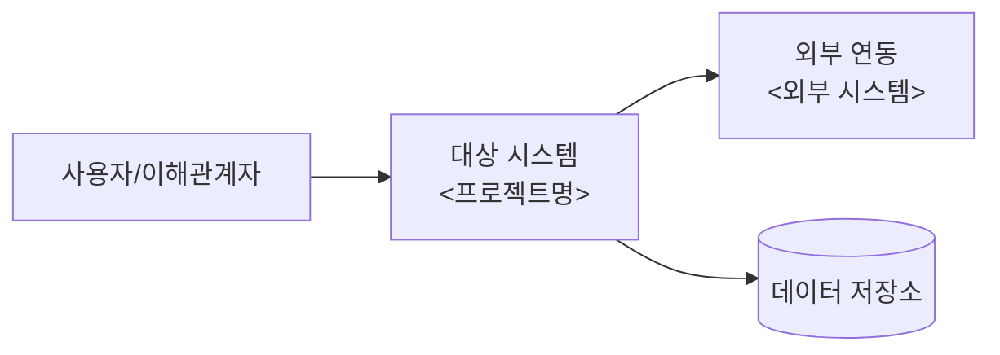

# 요구사항정의서 — &lt;프로젝트명&gt;

- **설명**: &lt;프로젝트명&gt;의 요구사항 수집·구체화 결과 정의(개요·기능·시스템·성능·제약)
- **생성일**: 2026-09-03
- **수정일**: 2026-09-03
- **버전**: 1.1

<!-- 
    작성 요령: docs/[GUIDE]_AUTHORING_STYLE.md 준수 
     `<...>`·`TBD`는 실제 값으로 교체. 자료 부족·추론 필요 지점은 임의 확정 대신 질의 후 반영. 
-->

---

## 목차

| 목차 | 제목 | 간략설명 |
|---|---|---|
| §1 | 프로젝트 개요 | 배경·필요성·핵심 성공달성 요소(CSF) |
| §2 | 기능 요구사항 | 기능 목차표 + 기능별 세분 상세(입력·처리·출력·AC) |
| §3 | 시스템 요구사항 | 구성·인터페이스·데이터·연동 목차표 + 세분 상세 |
| §4 | 성능 요구사항 | 응답시간·처리량·동시성·가용성 목차표 + 세분 상세 |
| §5 | 기타 및 제약사항 | 보안·규정·호환·일정·가정·제약 목차표 + 세분 상세 |

목적: &lt;프로젝트명&gt;의 요구사항을 검증 가능한 형태로 확정, 이후 설계·구현·검증의 입력 기준 제공.

---

## §1 프로젝트 개요

**배경**

- &lt;현행 문제·요구 배경 서술&gt;

**필요성**

- &lt;해결 시 기대효과·미해결 시 손실 서술&gt;

**핵심 성공달성 요소 (CSF)**

| 요소 | 성공 판단 기준(측정 가능 형태) |
|---|---|
| &lt;CSF-1&gt; | &lt;예: 로그인 성공률 99% 이상&gt; |
| &lt;CSF-2&gt; | &lt;예: 신규 온보딩 소요 10분 이내&gt; |

**시스템 컨텍스트**

---

## §2 기능 요구사항

기능 단위를 **목차표**로 나열 후, 각 기능을 **세분 항목**으로 상세화.

### 2-1. 기능 목차

| ID | 기능명 | 우선순위 | 개요 | 비고 |
|---|---|---|---|---|
| FR-01 | &lt;기능명&gt; | High/Mid/Low | &lt;한 줄 개요&gt; | &lt;특이사항·참고&gt; |
| FR-02 | &lt;기능명&gt; | | | |

### 2-2. 기능 상세

<!-- 각 FR-ID 별로 아래 블록 복제·작성 -->

#### FR-01 &lt;기능명&gt;

| 항목 | 내용 |
|---|---|
| 개요 | &lt;기능 목적·범위&gt; |
| 입력 | &lt;입력 데이터·조건&gt; |
| 처리 | &lt;처리 규칙·로직&gt; |
| 출력 | &lt;결과·화면·응답&gt; |
| 인수조건(AC) | AC-1 &lt;검증 가능 조건&gt; · AC-2 &lt;…&gt; |
| 예외·오류 | &lt;실패·경계 처리&gt; |
| 비고 | &lt;특이사항·참고·미결 사항&gt; |

---

## §3 시스템 요구사항

시스템 구성·연동 항목을 **목차표**로 나열 후 **세분 항목**으로 상세화.

### 3-1. 시스템 항목 목차

| ID | 구분 | 항목 | 개요 |
|---|---|---|---|
| SR-01 | 아키텍처·구성 | &lt;항목&gt; | &lt;한 줄 개요&gt; |
| SR-02 | 인터페이스 | &lt;항목&gt; | |
| SR-03 | 데이터 | &lt;항목&gt; | |
| SR-04 | 외부 연동 | &lt;항목&gt; | |
| SR-05 | 운영 환경 | &lt;항목&gt; | |

### 3-2. 시스템 항목 상세

#### SR-01 &lt;항목명&gt;

| 항목 | 내용 |
|---|---|
| 개요 | &lt;구성·역할&gt; |
| 상세 | &lt;구성요소·인터페이스·프로토콜·형식&gt; |
| 제약 | &lt;환경·버전·용량 제약&gt; |
| 관련 요구 | &lt;연관 FR·SR 참조&gt; |

---

## §4 성능 요구사항

측정 가능한 지표를 **목차표**로 나열 후 필요 시 **세분 항목**으로 상세화.

### 4-1. 성능 지표 목차

| ID | 지표 | 목표값 | 측정 조건 |
|---|---|---|---|
| PR-01 | 응답시간 | &lt;예: 95%tile 1초 이내&gt; | &lt;대상 API·부하 조건&gt; |
| PR-02 | 처리량 | &lt;예: 100 TPS&gt; | &lt;측정 구간&gt; |
| PR-03 | 동시 사용자 | &lt;예: 500명&gt; | &lt;세션 기준&gt; |
| PR-04 | 가용성 | &lt;예: 99.9%&gt; | &lt;측정 기간&gt; |
| PR-05 | 자원 사용 | &lt;예: CPU 70% 이하&gt; | &lt;피크 기준&gt; |

### 4-2. 성능 지표 상세

#### PR-01 &lt;지표명&gt;

| 항목 | 내용 |
|---|---|
| 목표 | &lt;목표값·허용 범위&gt; |
| 측정 방법 | &lt;도구·시나리오·부하&gt; |
| 대상 | &lt;대상 기능·구간&gt; |
| 근거 | &lt;산정 근거·기준&gt; |

---

## §5 기타 및 제약사항

비기능·정책·전제 항목을 **목차표**로 나열 후 필요 시 **세분 항목**으로 상세화.

### 5-1. 기타·제약 목차

| ID | 구분 | 내용 |
|---|---|---|
| ETC-01 | 보안 | &lt;인증·인가·암호화·로그&gt; |
| ETC-02 | 규정·컴플라이언스 | &lt;법규·사내 정책&gt; |
| ETC-03 | 호환성 | &lt;브라우저·OS·버전&gt; |
| ETC-04 | 일정·마일스톤 | &lt;주요 일정&gt; |
| ETC-05 | 가정(Assumption) | &lt;전제 조건&gt; |
| ETC-06 | 제약(Constraint) | &lt;기술·자원·범위 제약&gt; |

### 5-2. 기타·제약 상세

#### ETC-01 &lt;항목명&gt;

| 항목 | 내용 |
|---|---|
| 내용 | &lt;요건 상세&gt; |
| 영향 범위 | &lt;영향 기능·시스템&gt; |
| 관련 요구 | &lt;연관 FR·SR·PR 참조&gt; |

---

## 참조 파일

| 영역 | 경로 |
|---|---|
| 가이드 작성 방식(문체·구조 정본) | `../docs/[GUIDE]_AUTHORING_STYLE.md` |

---

## 문서 갱신 이력

| 버전 | 수정일 | 주요 변경사항 |
|---|---|---|
| 1.0 | 2026-09-03 | 요구사항정의서 템플릿 초판(개요·기능·시스템·성능·기타/제약 5부 구성 + 목차표·세분 상세 서식) |
| 1.1 | 2026-09-03 | 기능 요구사항 서식에서 `관련 IA·데이터` 항목 제거, `비고` 항목으로 교체 |
