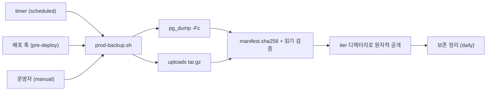

# prod 백업 가이드

| 항목 | 내용 |
|---|---|
| 설명 | prod DB·업로드 파일 백업의 정책·설치·실행 절차 정의 |
| 생성일 | 2026-10-01 |
| 수정일 | 2026-10-01 |
| 버전 | 0.1.0 |

prod 백업은 PostgreSQL custom dump와 업로드 볼륨 archive를 한 세트로 생성하고, 생성 직후 체크섬·읽기 검증을 수행함. 일일 예약(systemd timer)·배포 전(pre-deploy)·수동 3가지 경로가 동일 스크립트와 동일 설정 파일을 공유함. 프로젝트 고유값은 `<...>` 표기로 두었으며 설치 전 전부 치환함.

---

## 목차

| 번호 | 제목 | 설명 |
|---|---|---|
| 1 | 백업 정책 | 대상·주기·보존·권한 |
| 2 | 구성 파일 | 템플릿 파일과 서버 설치 위치 |
| 3 | 치환 값 | 프로젝트별로 결정할 값 |
| 4 | 설치 절차 | 설정·유닛 설치와 예약 활성화 |
| 5 | 실행·확인 | 3가지 실행 경로와 성공 판정 |
| 6 | 배포 연동 | pre-deploy 백업과 배포 중단 규칙 |
| 7 | 산출물 구조 | 백업 세트 디렉터리 구성 |
| 8 | 필수 금지 | 운영 시 금지 항목 |

---

## 1. 백업 정책

| 항목 | 정책 |
|---|---|
| 대상 | PostgreSQL custom dump(`pg_dump -Fc`) + 업로드 볼륨 archive(`tar -czf`) |
| 제외 | 캐시 저장소(Redis 등) 등 재생성 가능한 데이터 |
| 저장 경로 | `<백업 저장 루트, 예: /home/pntadmin/backups/myapp_prod>` |
| 일일 | `<백업 실행 일정, 예: 매일 03:00 Asia/Seoul>`, `daily/`에 최근 `<보존 개수, 예: 7>`개 유지 |
| 배포 | `pre-deploy/`에 1개 유지, 기존 삭제 → 새 백업 → 성공 시 배포 진행 |
| 수동 | `manual/`에 보관, 자동 정리 없음(운영자 직접 정리) |
| 보존 삭제 시점 | 새 백업 성공 후 초과분 삭제(일일 기준) |
| 권한 | `<배포 계정, 예: pntadmin>` 소유, 디렉터리 0700·파일 0600 |
| 검증 | SHA-256 manifest 자체 대조, `pg_restore --list`·`tar -tzf` 읽기 검증 |
| 미포함 | 주간·월간 백업, 외부 전송, 암호화, 실제 복원 리허설 |

- 배포 백업은 생성 전에 기존 세트를 삭제하므로, 배포 백업 생성이 실패하면 직전 배포 백업이 없는 상태가 됨. 일일·수동 백업은 유지됨.
- 외부 전송·암호화가 필요한 프로젝트는 `TRANSFER_ENABLED` 정책 가드와 암호화 단계를 별도 요구사항으로 확장함.



---

## 2. 구성 파일

| 템플릿 파일 | 서버 설치 위치 |
|---|---|
| `operation/backup/scripts/prod-backup.sh` | `<운영 자산 설치 경로, 예: /opt/myapp/operation>/backup/prod-backup.sh` |
| `operation/backup/systemd/prod-backup.env.example` | `/etc/<앱키>/prod-backup.env` |
| `operation/backup/systemd/prod-backup.service` | `/etc/systemd/system/<앱키>-prod-backup.service` |
| `operation/backup/systemd/prod-backup.timer` | `/etc/systemd/system/<앱키>-prod-backup.timer` |

- 유닛 파일명은 설치 시 `<앱키>-` 접두사를 붙여 다른 서비스와 구분함.
- 설치 경로는 배포 작업 디렉터리·소스 트리와 독립적임. 배포는 이미지 전송 방식이라 서버에 소스가 없으므로, 백업 자산은 4절 절차로 따로 설치함.
- 배포 스크립트는 백업 파일을 자동 전송하지 않음.
- 스크립트는 LF 개행으로 설치함(CRLF 설치 시 `bash` 실행 실패).

---

## 3. 치환 값

설치 전 아래 값을 프로젝트 값으로 확정함.

| 치환 표기 | 설명 | 확인 방법 | 예시 |
|---|---|---|---|
| `<앱키>` | 설정 디렉터리·유닛 파일명에 쓰는 소문자 식별자 | 프로젝트 명명 규칙 | `myapp` |
| `<앱 표시명>` | 유닛 `Description`에 쓰는 표시 이름 | 프로젝트 명명 규칙 | `MyApp` |
| `<배포 계정>` | 백업 실행·소유 계정, Docker 접근 권한 보유 | 서버 운영 계정 | `pntadmin` |
| `<운영 자산 설치 경로>` | 서버의 운영 스크립트 설치 절대경로 | 운영 정책(소스 트리와 무관) | `/opt/myapp/operation` |
| `BACKUP_ROOT` | 백업 저장 루트 절대경로 | 운영 정책 | `/home/pntadmin/backups/myapp_prod` |
| `BACKUP_RETENTION_DAILY` | 일일 보존 세트 수 | 운영 정책 | `7` |
| `DB_CONTAINER` | prod DB 컨테이너명 | `docker ps --filter name=<앱키>` | `myapp_prod_db` |
| `UPLOAD_VOLUME` | 업로드 파일 볼륨명 | `docker volume ls` | `myapp-prod_myapp_prod_uploads` |
| `DOCKER_COMMAND` | docker 실행 파일 절대경로 | `which docker` | `/usr/bin/docker` |
| `ARCHIVE_IMAGE` | 아카이빙용 경량 이미지 | 서버 사전 pull | `alpine:3.20` |
| `OnCalendar` | 예약 실행 일정 | 운영 정책 | `*-*-* 03:00:00 Asia/Seoul` |

- `BACKUP_ROOT`·`DB_CONTAINER`·`UPLOAD_VOLUME`은 스크립트 기본값이 없어 미설정 시 즉시 종료함.
- 스크립트 상단 `config=` 기본 경로의 `/etc/app/`도 `<앱키>`로 치환함.

---

## 4. 설치 절차

실행 환경 전제: `<배포 계정>`의 Docker 접근 권한, `bash`·`flock`·`sha256sum`·`tar` 사용 가능, `ARCHIVE_IMAGE` 서버 확보.

서버는 애플리케이션 소스를 보유하지 않으므로, 아래 1단계에서 작업 PC의 리포 사본을 서버로 전송함. 설치 후에는 소스·배포 디렉터리와 독립적으로 동작함.

1. **파일 전송** — 작업 PC의 리포 루트에서 실행함.

```bash
scp -r operation/backup <배포 계정>@<서버 호스트>:/tmp/backup-install
```

2. **스크립트 설치** — `<운영 자산 설치 경로>` 아래에 실행 스크립트만 설치함(LF 개행 유지).

```bash
sudo install -D -o root -g root -m 0755   /tmp/backup-install/scripts/prod-backup.sh   <운영 자산 설치 경로, 예: /opt/myapp/operation>/backup/prod-backup.sh
```

3. **설정 파일 설치** — `prod-backup.env.example`의 `<...>`를 전부 치환해 설치함.

```bash
sudo install -D -o root -g <배포 계정 그룹> -m 0640   /tmp/backup-install/systemd/prod-backup.env.example /etc/<앱키>/prod-backup.env
sudo vi /etc/<앱키>/prod-backup.env   # <...> 값 치환
```

4. **백업 디렉터리 준비** — 배포 계정 소유 0700으로 생성함.

```bash
sudo install -d -o <배포 계정> -g <배포 계정 그룹> -m 0700 <BACKUP_ROOT 값>
```

5. **유닛 설치** — `<...>` 치환 후 `<앱키>-` 접두사 파일명으로 설치함.

```bash
sudo install -m 0644 /tmp/backup-install/systemd/prod-backup.service   /etc/systemd/system/<앱키>-prod-backup.service
sudo install -m 0644 /tmp/backup-install/systemd/prod-backup.timer   /etc/systemd/system/<앱키>-prod-backup.timer
sudo vi /etc/systemd/system/<앱키>-prod-backup.service   # <...> 값 치환
sudo vi /etc/systemd/system/<앱키>-prod-backup.timer     # <...> 값 치환
rm -rf /tmp/backup-install
```

6. **수동 백업 검증** — 5절 수동 실행으로 세트 생성·검증 성공을 확인함.

7. **예약 활성화** — 수동 백업 성공 확인 후 실행함.

```bash
sudo systemctl daemon-reload
sudo systemctl enable --now <앱키>-prod-backup.timer
systemctl list-timers <앱키>-prod-backup.timer --all
```

`Persistent=true`로 서버 정지 중 누락된 일정은 기동 후 보충 실행함. 스크립트를 갱신할 때는 1·2단계만 재수행함.

---

## 5. 실행·확인

| 경로 | 실행 주체 | 명령 | tier |
|---|---|---|---|
| 일일 | systemd timer | `prod-backup.sh --reason scheduled` | `daily/` |
| 배포 | 배포 스크립트 훅 | `prod-backup.sh --reason pre-deploy` | `pre-deploy/` |
| 수동 | 운영자 | `prod-backup.sh --reason manual` | `manual/` |

수동 실행:

```bash
sudo -u <배포 계정> bash <운영 자산 설치 경로>/backup/prod-backup.sh --reason manual
```

- **성공 기준**: exit 0, 표준출력으로 출력된 세트 경로에 `postgres.dump`·`uploads.tar.gz`·`manifest.sha256` 존재.
- **자동 검사 범위**: SHA-256 대조, `pg_restore --list`, `tar -tzf`. 실제 복원 검증은 미포함(`[GUIDE]_PROD_RESTORE.md` 참조).
- **감사 로그**: `<BACKUP_ROOT>/audit.log`에 `start`·`lock`·`policy`·`pg_dump`·`manifest`·`read_validation`·`publish`·`retention`·`transfer`·`complete` 이벤트 기록.
- **예약 실패 확인**: `journalctl -u <앱키>-prod-backup.service`.
- **동시 실행**: `flock` 단일 실행 보장, 중복 실행은 exit 75로 종료.

| exit 코드 | 의미 | 조치 |
|---|---|---|
| 0 | 성공 | 출력 경로·audit.log 확인 |
| 2 | 인자·설정·권한 검증 실패 | 설정 파일 값과 디렉터리 소유·권한 확인 |
| 75 | 다른 백업 실행 중 | 선행 실행 종료 후 재시도 |
| 그 외 | 백업 단계 실패 | audit.log의 `event=complete status=failed exit=` 확인 |

---

## 6. 배포 연동

- 배포 스크립트는 이미지 load·기동 **직전**에 원격으로 `<운영 자산 설치 경로>/backup/prod-backup.sh --reason pre-deploy`를 실행하고, 성공해야 이후 단계를 진행함.
- 백업 실패 시 배포를 중단함.
- 백업 훅 생략 옵션은 운영자가 별도 검증된 백업 세트와 감사 로그를 확인한 예외 상황에만 사용함.
- 배포 절차 전체는 `docs/[GUIDE]_DEPLOYMENT.md`를 정본으로 함.

---

## 7. 산출물 구조

```text
<BACKUP_ROOT>/
├── audit.log                     # 0600, 전 실행 이벤트 기록
├── .backup.lock                  # 0600, flock 대상
├── .staging/                     # 0700, 생성 중 임시 영역 (실패 시 삭제)
├── daily/                        # 0700, 최근 N개 유지
│   └── 20261001T030000Z-1234/    # 세트 = UTC타임스탬프-PID
│       ├── postgres.dump         # pg_dump custom format
│       ├── uploads.tar.gz        # 업로드 볼륨 archive
│       └── manifest.sha256       # 두 파일의 SHA-256
├── pre-deploy/                   # 0700, 1개 유지
└── manual/                       # 0700, 자동 정리 없음
```

- 세트는 `.staging/`에서 완성·검증 후 `mv -T`로 tier에 원자적으로 공개함. 공개된 세트는 항상 검증 완료 상태임.
- 보존 삭제는 `^[0-9]{8}T[0-9]{6}Z-[0-9]+$` 패턴의 비심볼릭링크 디렉터리만 대상으로 함.

---

## 8. 필수 금지

- 백업 루트를 `/`·홈 디렉터리·심볼릭링크로 지정하는 것 → 금지(스크립트가 exit 2로 차단).
- `TRANSFER_ENABLED=true` 설정 → 금지(외부 전송 미지원 정책, 스크립트가 exit 2로 차단).
- 수동 백업 검증 없이 timer를 먼저 활성화하는 것 → 금지(실패를 야간에 발견).
- 설정 파일에 DB 비밀번호를 기록하는 것 → 금지(DB 컨테이너 내부 환경변수 사용).

---

## 참조 파일

- `operation/backup/scripts/prod-backup.sh` — 백업 실행 스크립트(서버 설치 경로는 2절 참조)
- `operation/backup/systemd/prod-backup.env.example` — 설정 파일 템플릿
- `operation/backup/systemd/prod-backup.service` · `prod-backup.timer` — 예약 실행 유닛
- `operation/backup/[GUIDE]_PROD_RESTORE.md` — 백업 세트 복원 절차
- `docs/[GUIDE]_DEPLOYMENT.md` — 배포 절차 정본
- `docs/[GUIDE]_AUTHORING_STYLE.md` — 문서 작성요령

---

## 문서 갱신 이력

| 버전 | 수정일 | 주요 변경사항 |
|---|---|---|
| 0.1.0 | 2026-10-01 | 최초 작성 — prod 백업 정책·설치·실행 절차 템플릿화 |
