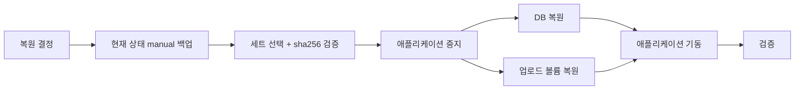

# prod 복원 가이드

| 항목 | 내용 |
|---|---|
| 설명 | 백업 세트로부터 prod DB·업로드 파일을 복원하는 절차 정의 |
| 생성일 | 2026-10-01 |
| 수정일 | 2026-10-01 |
| 버전 | 0.1.0 |

복원은 `[GUIDE]_PROD_BACKUP.md`가 생성한 세트(`postgres.dump`·`uploads.tar.gz`·`manifest.sha256`)를 입력으로 함. 운영 데이터를 덮어쓰는 작업이므로 복원 직전 `--reason manual` 백업을 선행하고, 스테이징 환경에서 동일 절차를 먼저 수행해 검증함. 절차는 템플릿 기준 초안이며 프로젝트별 1회 리허설로 확정함.

---

## 목차

| 번호 | 제목 | 설명 |
|---|---|---|
| 1 | 복원 판단 | 복원 대상 범위 결정 |
| 2 | 사전 조건 | 복원 전 필수 확인 |
| 3 | 세트 선택·무결성 확인 | 복원할 세트 결정과 검증 |
| 4 | DB 복원 | PostgreSQL custom dump 복원 |
| 5 | 업로드 파일 복원 | 볼륨 archive 복원 |
| 6 | 복원 후 검증 | 애플리케이션 정상 확인 |
| 7 | 리허설 | 스테이징 복원 훈련 |
| 8 | 필수 금지 | 복원 시 금지 항목 |

---

## 1. 복원 판단

| 상황 | 복원 범위 | 비고 |
|---|---|---|
| 마이그레이션·배포 사고 | DB + 업로드 | 직전 `pre-deploy/` 세트 사용 |
| 데이터 오삭제(DB) | DB만 | 업로드 파일은 현행 유지 |
| 업로드 파일 손실 | 업로드만 | DB는 현행 유지 |
| 서버 교체·재구축 | DB + 업로드 | 최신 `daily/` 세트 사용 |

- 복원 범위를 먼저 확정함. DB·업로드를 서로 다른 시점으로 복원하면 첨부 참조가 깨질 수 있음.



---

## 2. 사전 조건

- 복원 직전 현재 상태를 백업함: `bash <운영 자산 설치 경로, 예: /opt/myapp/operation>/backup/prod-backup.sh --reason manual`.
- 설정 값(`BACKUP_ROOT`·`DB_CONTAINER`·`UPLOAD_VOLUME`·`DOCKER_COMMAND`·`ARCHIVE_IMAGE`)은 `/etc/<앱키>/prod-backup.env`를 정본으로 함.
- 복원 작업 계정은 백업 실행 계정(`<배포 계정>`)과 동일하게 함.
- 복원 사유·대상 세트·수행자·시각을 사전에 기록함.

---

## 3. 세트 선택·무결성 확인

```bash
set -a; . /etc/<앱키>/prod-backup.env; set +a

# 세트 목록 확인 (최신순)
ls -1 "$BACKUP_ROOT/daily" "$BACKUP_ROOT/pre-deploy" "$BACKUP_ROOT/manual" 2>/dev/null

SET="$BACKUP_ROOT/<tier, 예: daily>/<세트명, 예: 20261001T030000Z-1234>"

# 체크섬 검증 — 전 항목 OK 여야 함
( cd "$SET" && sha256sum -c manifest.sha256 )

# 내용 읽기 검증
"$DOCKER_COMMAND" exec -i "$DB_CONTAINER" pg_restore --list < "$SET/postgres.dump" | head
tar -tzf "$SET/uploads.tar.gz" | head
```

- `sha256sum -c` 실패 세트는 복원 대상에서 제외하고 다른 세트를 선택함.

---

## 4. DB 복원

애플리케이션 컨테이너를 먼저 중지해 쓰기를 차단함.

```bash
docker compose -f docker-compose-prod.yml --env-file .env.prod stop <애플리케이션 서비스명, 예: backend frontend>
```

기존 스키마를 비우고 custom dump를 복원함.

```bash
# 복원 대상 DB 접속 정보는 DB 컨테이너 환경변수를 사용함(비밀값 미출력)
"$DOCKER_COMMAND" exec -i "$DB_CONTAINER" sh -c \
  'exec pg_restore -U "$POSTGRES_USER" -d "$POSTGRES_DB" --clean --if-exists --no-owner --single-transaction' \
  < "$SET/postgres.dump"
```

| 옵션 | 목적 |
|---|---|
| `--clean --if-exists` | 기존 객체 삭제 후 재생성 |
| `--no-owner` | 원본 소유자 불일치 무시 |
| `--single-transaction` | 실패 시 전체 롤백(부분 복원 상태 방지) |

- 복원 후 스키마 버전 확인: `SELECT version,success FROM flyway_schema_history ORDER BY installed_rank DESC LIMIT 3;`
- 백업 시점과 현재 코드의 스키마 버전이 다르면, 코드도 해당 시점 태그로 되돌려 기동함.

---

## 5. 업로드 파일 복원

기존 볼륨 내용을 비운 뒤 archive를 전개함. 볼륨 자체는 삭제하지 않음(compose 재생성 불필요).

```bash
"$DOCKER_COMMAND" run --rm --network none -i \
  -v "$UPLOAD_VOLUME:/target" "$ARCHIVE_IMAGE" \
  sh -c 'rm -rf /target/* /target/.[!.]* 2>/dev/null; exec tar -xzf - -C /target' \
  < "$SET/uploads.tar.gz"

# 전개 결과 확인
"$DOCKER_COMMAND" run --rm --network none -v "$UPLOAD_VOLUME:/target:ro" "$ARCHIVE_IMAGE" ls -la /target | head
```

- 부분 복원(특정 파일만)은 임시 디렉터리에 전개 후 필요한 경로만 복사함.

---

## 6. 복원 후 검증

```bash
docker compose -f docker-compose-prod.yml --env-file .env.prod up -d
```

| 확인 항목 | 방법 | 기대 |
|---|---|---|
| 컨테이너 상태 | `docker ps --filter name=<앱키>` | 대상 서비스 healthy |
| HTTP 응답 | 공개 엔드포인트 호출 | `200` |
| 스키마 버전 | `flyway_schema_history` 조회 | 대상 버전 적용 |
| 데이터 표본 | 핵심 테이블 건수·최신 레코드 | 백업 시점과 일치 |
| 첨부 파일 | 업로드 파일 다운로드 | 정상 응답 |

- 검증 완료 후 복원 사유·세트 경로·수행 결과를 운영 기록에 남김.

---

## 7. 리허설

- 프로젝트 도입 시 1회, 이후 주요 스키마 변경 시 스테이징에서 전체 절차를 수행해 소요 시간과 명령을 확정함.
- 리허설로 확정된 명령·소요 시간을 이 문서의 4·5절에 반영함.
- 자동 백업은 `pg_restore --list`·`tar -tzf` 읽기 검증까지만 수행하므로, 실제 복원 가능성은 리허설로만 확인됨.

---

## 8. 필수 금지

- 복원 전 현재 상태 백업(`--reason manual`)을 생략하는 것 → 금지(복원 실패 시 되돌릴 지점 소실).
- 애플리케이션 기동 상태에서 DB를 복원하는 것 → 금지(쓰기 충돌·부분 복원).
- `sha256sum -c` 실패 세트를 복원하는 것 → 금지(손상 데이터 적용).
- 업로드 볼륨을 `docker volume rm`으로 삭제 후 재생성하는 것 → 금지(compose 참조·권한 불일치). 내용만 교체함.

---

## 참조 파일

- `operation/backup/[GUIDE]_PROD_BACKUP.md` — 백업 정책·설치·실행 정본
- `operation/backup/scripts/prod-backup.sh` — 복원 전 manual 백업 실행
- `operation/backup/systemd/prod-backup.env.example` — 설정 값 정본
- `docs/[GUIDE]_DEPLOYMENT.md` — 배포·롤백 절차
- `docs/[GUIDE]_BACKEND_MIGRATION.md` — 스키마 버전 확인

---

## 문서 갱신 이력

| 버전 | 수정일 | 주요 변경사항 |
|---|---|---|
| 0.1.0 | 2026-10-01 | 최초 작성 — 백업 세트 기반 DB·업로드 복원 절차 정의 |
